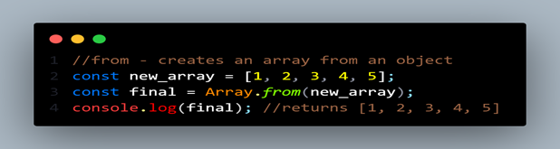
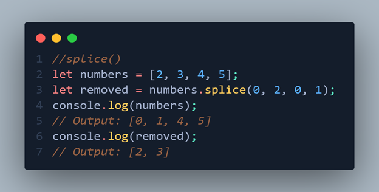
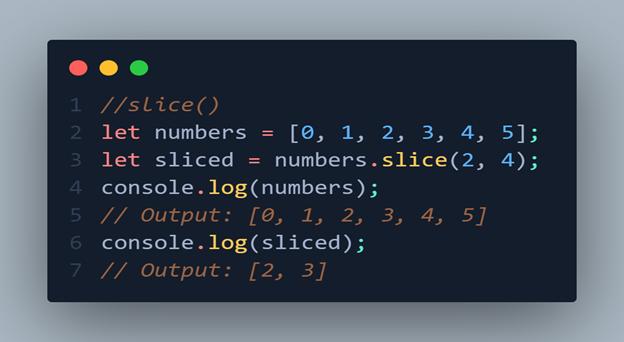

# array

1. An array is an ordered list of values.
2. Each value is called an element specified by an index.
3. An array can hold values of mixed types. For example, you can have an array that stores elements with the types number, string, and Boolean.
4. Array element starts from index no. 0. "[ ]" is used to create an array

```
  // let array1 = new Array[('Gyamzo',26,'Swayambhu')];
  let array1 = ['Gyamzo',26,'Swayambhu'];

  // update
  array[1] = 27;
  console.log(array1); //Gyamzo, 27, Swayambhu
```

You can access elements in an array by using the square brackets and the index of the element that you want to access. The index of an array starts from 0 and goes up to the length of the array minus one.

```
  let arr = [1,2,3,4,5]

  //To access the first element of the array, you would use:
  let firstElement = arr[0];

  //To access the last element of the array, you would use:
  let lastElement = arr[arr.length - 1];

  //You can also modify elements in an array by assigning a new value to a specific index:
  arr[2] = 42; // [1,2,45,4,5]
```

## Array.at (ECMA 2022)

New feature of ECMA 2022, better performance.

```
  //array.at(): ECMA 2022 NEW FEATURE
  const arr1 = [1, 2, 3, 4, 5];
  console.log(arr1[4]); //5
  console.log(arr1[-1]); //undefined
  console.log(arr1.at(-1)); //5
  console.log(arr1.at()); // 1, shows 1st value

```

Previously, we couldn’t use negative value to access element, but the new feature i.e., array.at() solve this issue.

## Array built-in methods

1. Array.from()



2. splice()

splice(start, deleteCount, [item1 [, item2 [, ...]]]):

The splice() method changes the contents of an array by removing or replacing existing elements and/or adding new elements in place. The start parameter specifies the starting index of the change and the deleteCount parameter specifies the number of elements to be removed. Additional elements to be added can be specified as arguments after the deleteCount parameter. The splice() method returns the removed elements as a new array.



In this example, the splice() method is used to remove the first two elements of the numbers array and add the numbers 0 and 1 in their place. The splice() method returns the removed elements as a new array, which is logged to the console.

3. slice()

slice(start, [end]):
The slice() method returns a shallow copy of a portion of an array into a new array object selected from start to end (end not included). The original array will not be modified. If end is omitted, slice() extracts to the end of the array.



In this example, the slice() method is used to extract the elements of the numbers array from index 2 to index 4 (not included) into a new array. The original array remains unchanged, and the new array is logged to the console.
