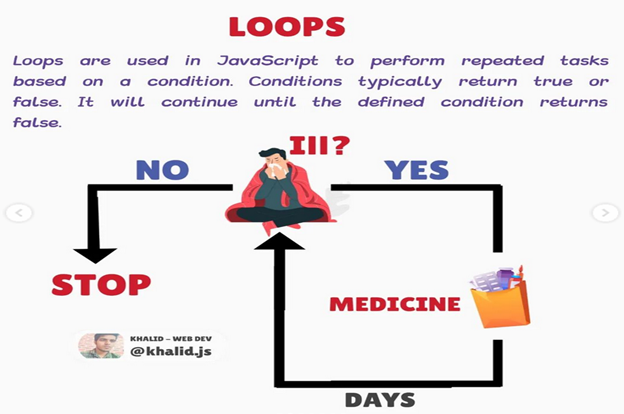

# LOOP

- [LOOP](#loop)
  - [Loop Definition](#loop-definition)
  - [Type of Loops](#type-of-loops)
    - [For loop](#for-loop)
    - [While loop](#while-loop)
    - [Do while loop](#do-while-loop)
    - [For of loop](#for-of-loop)
    - [For in loop](#for-in-loop)

## Loop Definition

A loop is a control flow statement used to execute a block of code repeatedly until the condition given in the loop is true. The most common use of loops is to repeat a block of code several times. When the condition is false the loop stops.



For example, if we want to print "Hello, World!" 10 times then instead of writing printing code 10 times we can use a loop and write the code once.

Example: `loop`

```js
for (let i = 0; i < 10; i++) {
  console.log("Loop", i);
}

//first i assign it value to 0 and increase letter, this is called post increment

/*Note:
first i = 0 (one time only); 0 < 10 => true; i++ =>0+1=1, code repeats untill the condition is true,
1 < 10 => true; i++ => 1 + 1 = 2 and so on

// post and pre increment
// let x = 0;
// let d = 0;
// const z = x++; // x = x+1, post increment, first assign itself and increase later

// const w = ++d; // d = d+1, pre increment, first value should be increased
// console.log(z, w); // 0 and 1
*/
```

## Type of Loops

### For loop

- 1st part of the loop is the initial condition,
- 2nd part is the condition,
- 3rd part is the increment/decrement

Example: `code`

```js
for (let i = 0; i < 10; i++) {
  square = i * i;
  console.log(square); //returns 1, 4, 9, 16, 25, 36, 49, 64, 81, 100
}
```

Sometimes, we might want a loop to run a number of times without being certain of what the number of iterations will be. Instead of declaring a static number, as we did in previous examples, we can make use of the length property of an array to have the loop run as many times as there are items in the array.

```js
// Declare array with 3 items
let fish = ["flounder", "salmon", "pike"];
// Initialize for loop to run for the total length of an array 0; i < fish.length; i++) {
for (let i = 0; i < fish.length; i++) {
  // Print each item to the console
  console.log(fish[i]);
}
```

### While loop

In JavaScript, a while statement is a loop that executes as long as the specified condition evaluates to true.
Example: `while loop`

```js
// condition is checked before the code is executed
let i = 0;
while (i < 10) {
  console.log(i); // 0,1,2,3,4,5,6,7,8,9
  i++; //updating
}
```

### Do while loop

The loop will always be executed at least once, even if the condition is false because the code block is executed before the condition is tested.

Example: `do while loop`

```js
// executes a block of code once before the condition is checked
let i = 1;
do {
  console.log(i); //1,2,3,4,5,6,7,8,9
  i++;
} while (i < 10);
```

### For of loop

The for-of-loop (ES6 Feature) in JavaScript allows you to iterate over iterable objects (arrays, sets, maps, strings, etc.). The for...of loop cannot be used to iterate over an object.

Example: `for of loop`

```js
// for of loop iterates over strings
const names = "John Doe";
for (let name of names) {
  console.log(name); //returns J, o, h, n, D, o, e
}

//for of loop - iterates over arrays
const numbers = [1, 2, 3, 4, 5];
for (let number of numbers) {
  console.log(number); //returns 1, 2, 3, 4, 5
}
```

### For in loop

The JavaScript for in statement mainly loops through the properties of an Object:

Example: `for in loop`

```js
const shark = {
  species: "great white",
  color: "white",
  numberOfTeeth: Infinity,
};
// Print property names of object
for (attribute in shark) {
  console.log(attribute);
}
//Output: species, color, numberOfTeeth

// Print property values of object
for (attribute in shark) {
  console.log(shark[attribute]);
  //output: great white, white, Infinity

  // Print names and values of object properties
  for (attribute in shark) {
  }
  console.log(`${attribute}`.toUpperCase() + `: ${shark[attribute]}`);
}
```

In this example, the for...in loop is used to iterate over the properties of the shark object. The loop uses the attribute variable to store the current property name on each iteration, and shark[attribute] is used to access the value of that property.

"""
Note: You should not use for...in to iterate over an array where the index order is important.

It is not recommended to use for...in loop to iterate over an array in JavaScript, as for...in was designed to work with objects, and not specifically with arrays.

If you want to iterate over an array, it is better to use the for loop or the for...of loop instead. The for loop provides a more straightforward way to access the elements of an array:

"""
