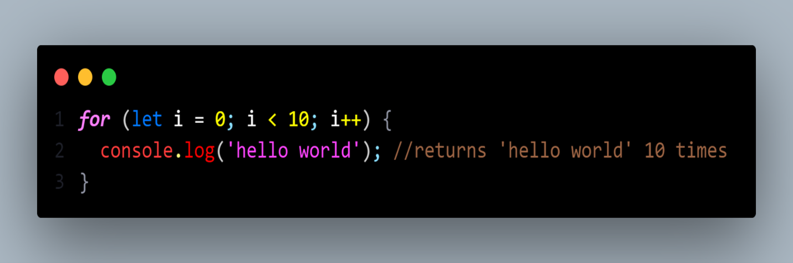

# LOOP

A loop is a control flow statement used to execute a block of code repeatedly until the condition given in the loop is true. The most common use of loops is to repeat a block of code several times. When the condition is false the loop stops.

For example, if we want to print "Hello, World!" 10 times then instead of writing printing code 10 times we can use a loop and write the code once.

