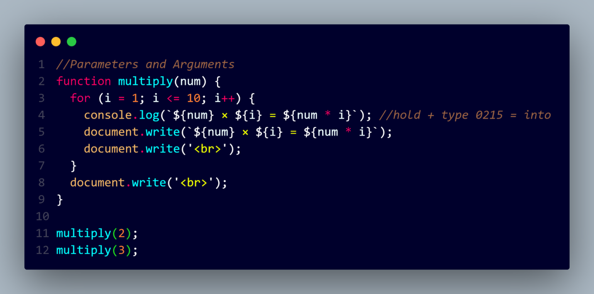
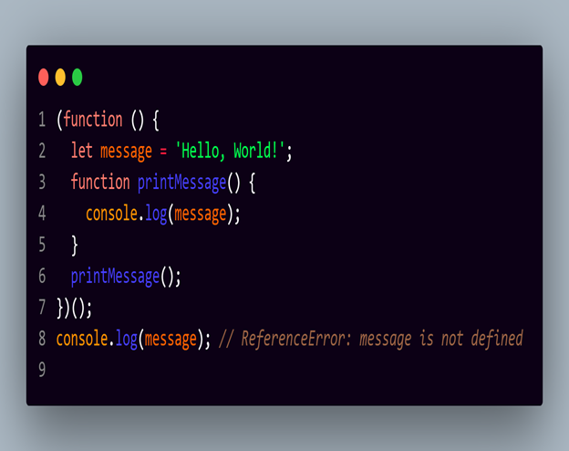
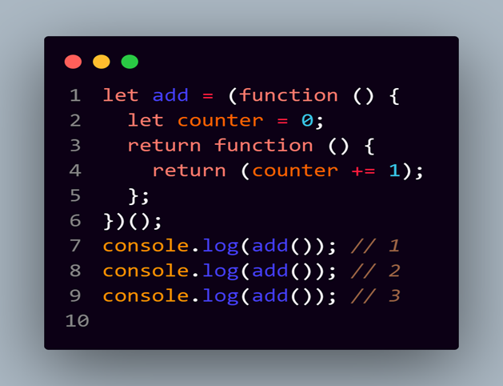
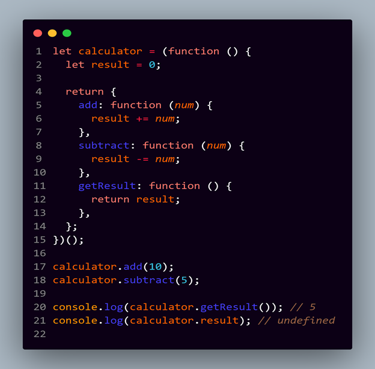
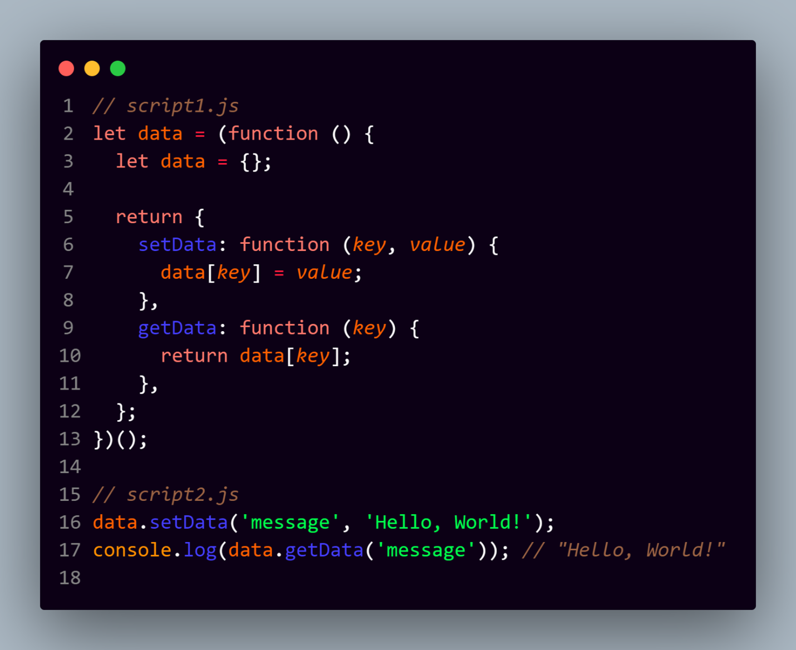
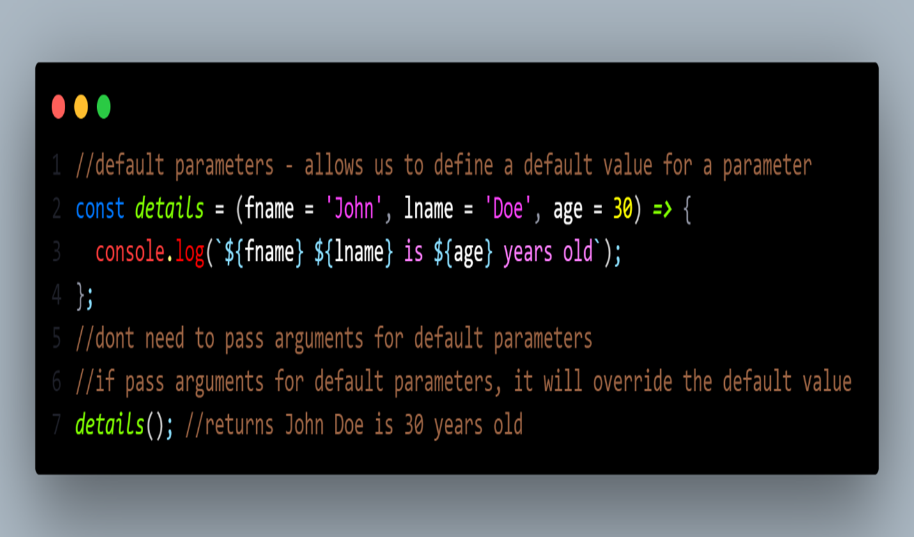
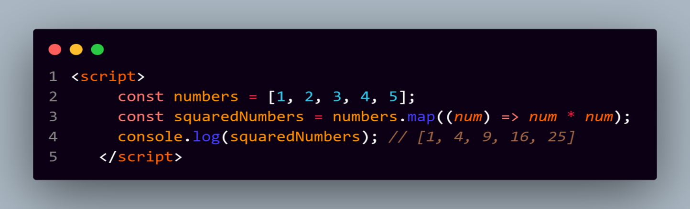
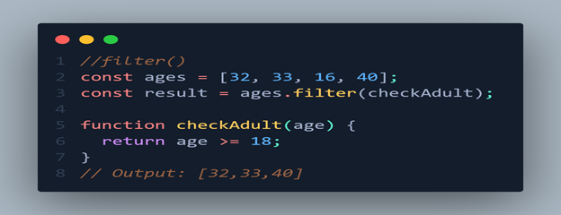

# function

The function is a block of code to perform a specific task. So, you don’t have to write the code for the same task again and again but create a function and call it wherever the task needed to be performed. “function” is a keyword to create a function.


```
  //function with no parameters
  function hello() {
    console.log("Hello World");
  }
  //calling the function, we can call the functin many times as we want
  hello();
  hello();

  // it return 'Hello World' twice

```

## Parameters and Arguments

```
  function greet(name) {
    console.log("Hello", +name + "!");
  }

  let userName = "John Doe";
  greet(userName); // Hello, John Doe!

```

In this example, the greet function takes a single parameter, name, which is used to receive the value passed to the function when it is called. The userName variable is defined to store the string "John Doe", which is then passed as an argument to the greet function when it is called on the last line of the code

Example:



## The arguments object

In JavaScript, every function has a special object called the arguments object, which provides access to the arguments passed to the function. The arguments object in JavaScript is an array-like object accessible inside functions that contain the values of the arguments passed to that function. By using an argument object, you don’t need to define parameters.

Here's an example:

```
  function sum() {
    let result = 0;

    for (let i = 0; i < arguments.length; i++) {
      result += arguments[i];
    }
    return result;
    console.log(sum(1, 2, 3, 4, 5));
  }

```

In this example, the sum function takes an indefinite number of arguments and uses the arguments object to access their values. The arguments.length property provides the number of arguments passed to the function, and the arguments[i] syntax is used to access the value of the i-th argument. The sum function adds up all the arguments and returns the result.

## Function with a return statement or return value

The return statement ends function execution and specifies a value to be returned to the function caller. When a return statement is used in a function body, the execution of the function is stopped.

Here are some common uses of the return statement in programming:

• Returning a value from a function: Functions can perform calculations and return the result back to the caller using the return statement. This allows the result to be used by other parts of the program.

```
  // Returning a value from a function
  function multiply(num1, num2) {
    return num1 * num2;
  }

  let result = multiply(5, 10);
  console.log(result); // Output: 50

```

In this example, the multiply function takes two arguments num1 and num2 and multiplies them together using the \* operator. It then uses the return statement to return the result of the multiplication back to the caller of the function.

We can then call the multiply function and assign the returned value to a variable result, which we then log to the console. The output will be 50, which is the result of multiplying 5 and 10.

By using the return statement in this way, we can make our functions more flexible and reusable, as the returned value can be used by other parts of the program for further computation or to make decisions based on the result.

• Terminating a function early: If a function encounters an error condition or unexpected input, it can use the return statement to terminate the function early and return an error message or null value back to the caller.

```
  // terminating a function early
  function divide(num1, num2) {
    {
      if (num2 === 0) {
        return null; // Return null if denominator is zero
      }
      return num1 / num2;
    }
  }
  let result1 = divide(10, 2);
  console.log(result1); // Output: 5

  let result2 = divide(10, 0);
  console.log(result2); // Output: null

```

In this example, the divide function takes two arguments num1 and num2 and divides num1 by num2. However, if num2 is equal to 0, the function uses the return statement to exit early and return null.

We can then call the divide function with different arguments to test its behavior. The first call to divide with arguments 10 and 2 will return 5, which is the correct result. The second call to divide with arguments 10 and 0 will return null, indicating that the division by zero was not allowed and the function terminated early.

• Breaking out of a loop: Inside a loop, a return statement can be used to break out of the loop early and return a result.

```
  // breaking out of loop
  function findFirstPositive(numbers) {
    for (let i = 0; i < numbers.length; i++) {}
    if (numbers[i] > 0) {
      return numbers[i]; // Return the first positive number
    }

    return null; // Return null if no positive number is found
  }

  let numbers1 = [-5, 3, 7, -2, 0];
  let result1 = findFirstPositive(numbers1);
  console.log(result1); // Output: 3

  let numbers2 = [-5, -3, -7, -2, 0];
  let result2 = findFirstPositive(numbers2);
  console.log(result2); // Output: null

```

In this example, the findFirstPositive function takes an array of numbers as an argument and searches for the first positive number in the array. It uses a for loop to iterate through the array, and if it finds a positive number, it uses the return statement to exit the loop early and return the positive number back to the caller of the function.

We can then call the findFirstPositive function with different arrays to test its behavior. The first call to findFirstPositive with an array containing both positive and negative numbers will return 3, which is the first positive number in the array. The second call to findFirstPositive with an array containing only negative numbers and zero will return null, indicating that no positive number was found in the array.

• Returning multiple values: In some programming languages, a function can return multiple values using the return statement, separated by commas.

```
  // Returning multiple values
  function calculateStats(numbers) {
    let sum = 0;

    let min = numbers[0];

    let max = numbers[0];

    for (let i = 0; i < numbers.length; i++) {
      sum += numbers[i];
      if (numbers[i] < min) {
        min = numbers[i];
      }

      if (numbers[i] > max) {
        max = numbers[i];
      }
    }

    let avg = sum / numbers.length;
    return [sum, avg, min, max];
  }
  let numbers = [2, 5, 1, 10, 7];
  let [sum, avg, min, max] = calculateStats(numbers);
  console.log(`Sum: ${sum}, Avg: ${avg}, Min: ${min}, Max: ${max}`);
  // Output: Sum: 25, Avg: 5, Min: 1, Max: 10

```

In this example, the calculateStats function takes an array of numbers as an argument and calculates the sum, average, minimum, and maximum values of the array. It then returns an array containing these four values using the return statement.

We can then call the calculateStats function and use array destructuring to assign the returned values to individual variables. We can then log these values to the console to display the result. The output will be Sum: 25, Avg: 5, Min: 1, Max: 10, which is the sum, average, minimum, and maximum values of the numbers array.

## IIFE: Immediately Invoked Function Expression

An Immediately Invoked Function Expression (IIFE) is a self-executing anonymous function in JavaScript. It runs automatically as soon as it is defined and can't be re-invoked later. IIFEs are commonly used to create a private scope for variables and functions, avoiding polluting the global scope and conflicts with other variables with the same names.

```
  // IIFE are the function defined as a expression and executed immediately after creation
  let result = (function (a, b) {
    return a + b;
  })(1, 2);
  console.log(result); //returns 3

```

Immediately Invoked Function Expressions (IIFEs) can be used in several situations in JavaScript, including:

1. Isolating variables and functions: IIFEs allow you to create a new scope and isolate variables and functions from the global scope. This can help to prevent variable and function name collisions, especially when working on large projects with many contributors.



"In this example, an anonymous function is defined and immediately invoked as an IIFE. The function contains a let statement, which defines a local variable message, and a function printMessage, which prints the value of message to the console. The printMessage function is called within the IIFE, causing the value of message to be printed to the console.

After the IIFE is executed, an attempt is made to access the message variable from the global scope, but a ReferenceError is thrown because the message variable is not defined in the global scope. This demonstrates how the IIFE can be used to isolate variables and functions from the global scope."

2. Encapsulating code: IIFEs allow you to encapsulate code and data within a single unit, making it easier to understand and maintain.



"In this example, an IIFE returns a function that adds 1 to a counter each time it is called. The counter is defined within the IIFE and is not accessible from the outside. The returned function is assigned to the add variable in the global scope, making it accessible to the rest of the code.

When the add function is called multiple times, it returns the value of the counter, which is incremented each time the function is called. This demonstrates how the IIFE can be used to encapsulate code and data within a single unit, making it easier to understand and maintain."

3. Hiding implementation details: IIFEs allow you to hide the implementation details of your code, making it more secure and less prone to tampering.



"In this example, an IIFE returns an object with several methods for performing basic arithmetic operations. The result variable, which stores the current value of the calculator, is defined within the IIFE and is not accessible from the outside."

"The methods add, subtract, and getResult are exposed in the returned object, making them accessible from the outside. The methods can be used to perform arithmetic operations on the result variable, but the actual implementation details of the calculation are hidden within the IIFE."

"When the code is executed, the getResult method is called to retrieve the current value of the calculator, but an attempt to access the result variable directly from the global scope results in an undefined value. This demonstrates how the IIFE can be used to hide implementation details and make code more secure and less prone to tampering."

4. Sharing data between scripts: IIFEs allow you to share data between scripts in a controlled and secure manner, which is useful when working with third-party libraries.



"In this example, an IIFE is used to create a singleton object, data, that can be shared between scripts. The object contains methods setData and getData, which can be used to set and retrieve data stored in the data object.
The first script, script1.js, defines the data object. The second script, script2.js, uses the data object to set and retrieve data.

Since the data object is defined as an IIFE, it can be included in multiple scripts and will always reference the same data. This makes it possible to share data between scripts, even if the scripts are loaded asynchronously or in a different order."

## Anonymous Function or function expression

An anonymous function is a function that is declared without a named identifier. It is often used as a function expression and assigned to a variable, or passed as an argument to another function.

```
  //function expression
  let multiply = function (num1, num2) {
    return num1 * num2;
  };

  let result = multiply(5, 10);
  console.log(result); // Output: 50

```

In this example, we define a function multiply using a function expression. We start by declaring a variable multiply and assigning it a function that takes two arguments num1 and num2 and multiplies them together using the \* operator. Note that we don't use the function keyword to define the function; instead, we use an anonymous function expression (a function without a name) that is assigned to the multiply variable.

We can then call the multiply function using the variable name and passing it the two arguments 5 and 10. The function returns 50, which is the result of multiplying 5 and 10. We then log the result to the console.

Function expressions are useful because they allow us to define functions dynamically at runtime, assign them to variables, and pass them as arguments to other functions. They can also be used to create anonymous functions, which are useful for event listeners and callbacks.

## Arrow Function

An arrow function (also known as a "fat arrow function") is a shorthand syntax for writing anonymous functions in JavaScript. Arrow functions were introduced in ECMAScript 6 (ES6) and are widely used in modern JavaScript.

```
  `let greet = () => {
    console.log("hello world");
  };

  greet();`
```

Here's an example of an arrow function with arguments:

```
  let square = (num) => {
    return num * num;
  };
  console.log(square(5));
```

In this example, the arrow function square takes a single argument num and returns its square.

If the arrow function has only a single expression, you can omit the curly braces and return keyword. The result of the expression will automatically be returned.

Here's an example:

```
  let square = (num) => num * num;
  console.log(square(5));
```

### Default parameters

Arrow functions in JavaScript can have default parameters, which are used when the function is called without a value being passed for that parameter. Default parameters are specified by assigning a value to the parameter in the function definition.

For example:

```
const greeting = (name = 'stranger) => {
  retutn `Hello, ${name}`;
};

console.log(greeting()); //'Hello, stranger
console.log(greeting('John')); //'Hello, John
```



Advantages of using arrow functions in JavaScript include:

1. Shorter syntax: Arrow functions have a more concise syntax compared to traditional function expressions, making the code more readable and easier to write.
2. Implicit this: Arrow functions do not have their own this value, which means that they inherit the this value from their surrounding context, making it easier to work with this inside callbacks.
3. Lexical arguments: The arguments object is not available inside arrow functions, making it easier to manage function arguments.
4. No new keyword: Arrow functions cannot be used with the new keyword to create objects, making it harder to accidentally create objects in the wrong way.
5. Easy to use in functional programming: Arrow functions can be used in functional programming paradigms, making it easier to write functional code and to work with higher-order functions.

## Higher order Functions

### map()

Sometimes you may need to take an array and apply some procedure to its elements so that you get a new array with modified elements. "Creates a new array with the results of calling a provided function on every element in the calling array."



In this example, the map function is called on the numbers array and a callback function num => num \* num is passed as an argument. The map function returns a new array squaredNumbers with the results of squaring each element in the numbers array.

```
  const employees = [
    { name: "John", salary: 50000 },
    { name: "Jane", salary: 55000 },
    { name: "Jim", salary: 60000 },
  ];
  const updatedEmployees = employees.map((empLoyee) => {
    return {
      name: employee.name,
      salary: employee.salary + 5000,
      currency: "USD",
    };
  });
  console.log, updatedEmployees;

  /*  [  { name: 'John', salary: 55000, currency: 'USD'},
          { name: 'Jane', salary: 60000, currency: 'USD' },
          { name: 'Jim', salary: 65000, currency: 'USD' }
        ] ;
    */

  //In this example you get the new updated salary of all employees.
```

### filter()

The filter () method is used to create a new array from a given array consisting of only those elements from the given array which satisfy a condition set by the argument method.



```
  const products = [
    { name: "Apple", type: "fruit", price: 1.99 },

    { name: "Carrot", type: "vegetable", price: 0.99 },

    { name: "Banana", type: "fruit", price: 0.79 },
    { name: "Tomato", type: "vegetable", price: 1.49 },
    ,
  ];
  [];
  const filteredProducts = products.filter((product) => {
    return product.type === "fruit" && product.price < 1.0;
  });
  console.log(filteredProducts);
  /*
    { name: 'Banana', type: 'fruit', price: 0.79 }
    */

```

In this example, the filter function is used to create a new array of products that are fruits and have a price less than 1.00. The original products array is not modified. The filter function takes a callback function as an argument, which returns true for elements that should be included in the filtered array and false for elements that should be excluded. In this example, the callback function checks if the product type is 'fruit' and the price is less than 1.00.
