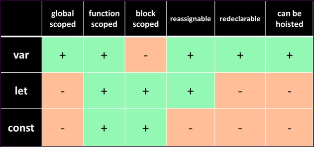
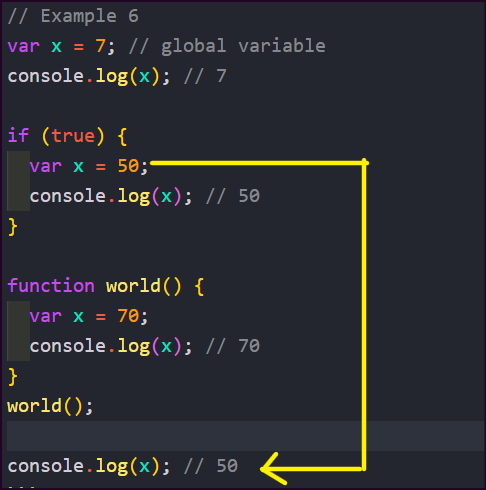

# scope

- [scope](#scope)
  - [Block Scope](#block-scope)
  - [Local/Function Scope](#localfunction-scope)
  - [Global Scope](#global-scope)
  - [Variable declaration: var, const, let](#variable-declaration-var-const-let)
    - [var](#var)
    - [let](#let)
    - [const](#const)
  - [More Examples: block, function, global scope](#more-examples-block-function-global-scope)

## Block Scope

Variables declared inside a block statement (enclosed in curly braces) are only accessible within that block and its nested blocks. This is known as block scope.

## Local/Function Scope

Variables declared inside a function are only accessible within that function and its nested functions. This is known as local or function scope.

## Global Scope

Variables declared outside of any function or block are accessible throughout the entire program. This is known as global scope.

---



---

## Variable declaration: var, const, let

- In JavaScript, there are three keywords available to declare a variable, and each has its differences. Those are var, let and const.
- The scope of a variable roughly means "where is this variable available in the code".

### var

- `var` declared variables are function scoped, meaning that when a variable is created in a function, everything in that function can access that variable. Besides, a function scoped variable created in a function can't be accessed outside this function.

`example:1`

```js
function myFunction() {
  var myVar = "Nick";
  console.log(myVar); // "Nick" - myVar is accessible inside the function
}
console.log(myVar); // Throws a ReferenceError, myVar is not accessible outside the function.
```

`example:2`

```js
function myFunction() {
  var myVar = "Nick";
  if (true) {
    var myVar = "John";
    console.log(myVar); // "John"
    // actually, myVar being function scoped, we just erased the previous myVar value "Nick" for "John"
  }
  console.log(myVar); // "John" - see how the instructions in the if block affected this value
}
console.log(myVar); // Throws a ReferenceError, myVar is not accessible outside the function.
```

Besides, var declared variables are moved to the top of the scope at execution. This is what we call `var hoisting`.

```js
console.log(myVar); // undefined -- no error raised
var myVar = 2;

// is understood at execution like:
// var myVar;
// console.log(myVar) // undefined -- no error raised
// myVar = 2;
```

---

### let

var and let are about the same, but let declared variables:

- are block scoped
- are not accessible before they are assigned
- can't be re-declared in the same scope

`example`

```js
function myFunction() {
  let myVar = "Nick";
  if (true) {
    let myVar = "John";
    console.log(myVar); // "John"
    // actually, myVar being block scoped, we just created a new variable myVar.
    // this variable is not accessible outside this block and totally independent
    // from the first myVar created !
  }
  console.log(myVar); // "Nick", see how the instructions in the if block DID NOT affect this value
}
console.log(myVar); // Throws a ReferenceError, myVar is not accessible outside the function.
```

```js
console.log(myVar); // raises a ReferenceError !
let myVar = 2;
```

> By contrast with var variables, if you try to read or write on a let or const variable before they are assigned an error will be raised. This phenomenon is often called `Temporal dead zone or TDZ`.

---

### const

const declared variables behave like let variables, but also they can't be reassigned.

To sum it up, const variables:

- are block scoped
- are not accessible before being assigned
- can't be re-declared in the same scope
- can't be reassigned

`example`

```js
const myVar = "Nick";
myVar = "John"; // raises an error, reassignment is not allowed

const myVar2 = "Nick";
const myVar2 = "John"; // raises an error, re-declaration is not allowed
```

> Note: But there is a subtlety : const variables are not immutable ! Concretely, it means that object and array const declared variables can be mutated.

For objects:

```js
const person = {
  name: "Nick",
};
person.name = "John"; // this will work ! person variable is not completely reassigned, but mutated
console.log(person.name); // "John"
person = "Sandra"; // raises an error, because reassignment is not allowed with const declared variables
```

For arrays:

```js
const person = [];
person.push("John"); // this will work ! person variable is not completely reassigned, but mutated
console.log(person[0]); // "John"
person = ["Nick"]; // raises an error, because reassignment is not allowed with const declared variables
```

---

## More Examples: block, function, global scope

`Example 1`

```js
let pie = 3.14; // global scope

// function scope
function function1() {
  let pie = 888;
  console.log(pie); //888, if pie is not defined inside function, it takes global variable

  const age = 27;
  console.log(age);
}
// let age = 78;
// console.log(age); //78
function1(); // function call

// block scope
if (true) {
  const fullName = "James Docker";
  console.log(fullName);
  console.log(pie); //global variable
}

console.log(pie); //3.14, pie is global variable and can be accessed from anywhere

// console.log(age); // age is a function scope cannot be accessed from outside
// console.log(fullName); // fullName is a block scope cannot be accessed from outside
```

---

`Example 2`

```js
function example2() {
  var varVariable = "var";
  console.log(varVariable);
  // console.log(letVariable); // letVariable is defined inside if block, cannot access inside function scope

  if (true) {
    let letVariable = "let";
    console.log(letVariable);
  }
  // console.log(letVariable); //throws error, because letVariable is not defined outside the if block

  const constVariable = "const";
  console.log(constVariable);
}
// console.log(varVariable); //throws error, because varVariable is function scope and can't be accessed outside function

example2();
```

---

`Example 3`

```js
// Example 3 : let keyword
let i_am = "superman";

if (true) {
  let you_are = "god of thunder";
  let i_am = "batman";
  console.log(i_am); //returns batman, scope of i_am is the block scope
}

console.log(i_am); //returns superman, because i_am is global variable
// console.log(you_are); // you_are is inside block scope, cannot access outside of block scope
```

---

`Example 4`

```js
// Example 4 : var keyword
var i_am = "superman";

if (true) {
  var you_are = "god of thunder";
  var i_am = "batman";
  console.log(i_am); //returns batman, scope of i_am is the block scope
}

console.log(i_am); //returns superman, because i_am is global variable
console.log(you_are); // returns god of thunder, because the scope of you_are is the global scope due to var keyword.
```

---

`Example 5`


```js
// Example 5
let x1 = 7;
console.log(x1);

// if (true) {
//   // var x1 = 50; //syntax error
//   // console.log(x1);
// }

function hello() {
  var x1 = 8;
  console.log(x1);
}
hello();
```

---

`Example 6`



`code`

```js
// Example 6
var x = 7; // global variable
console.log(x); // 7

if (true) {
  var x = 50;
  console.log(x); // 50
}

function world() {
  var x = 70;
  console.log(x); // 70
}
world();

console.log(x); // 50
```

---

It's generally recommended to use let and const instead for more predictable and block-scoped behavior.
