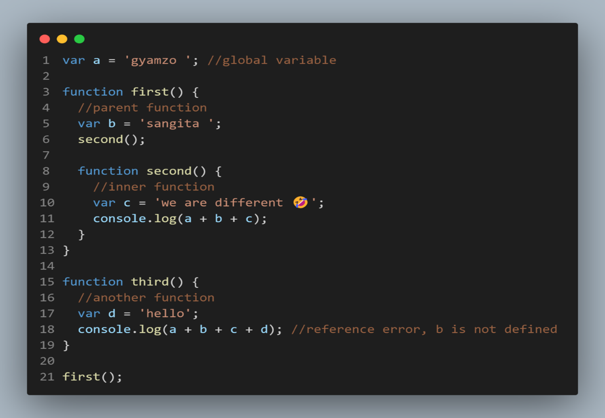
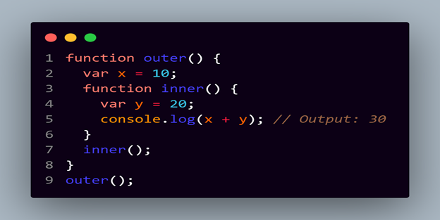
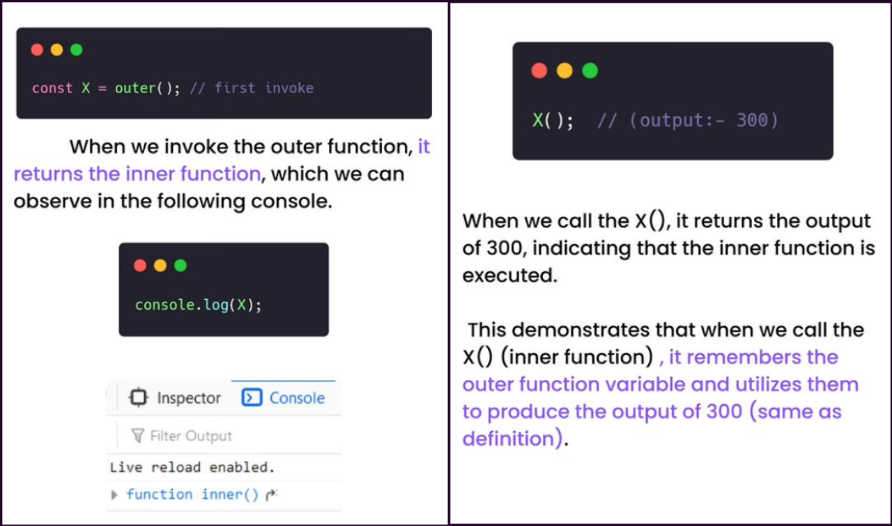
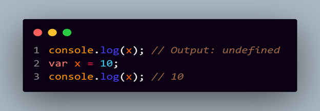
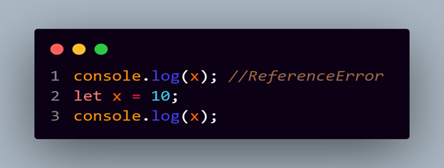
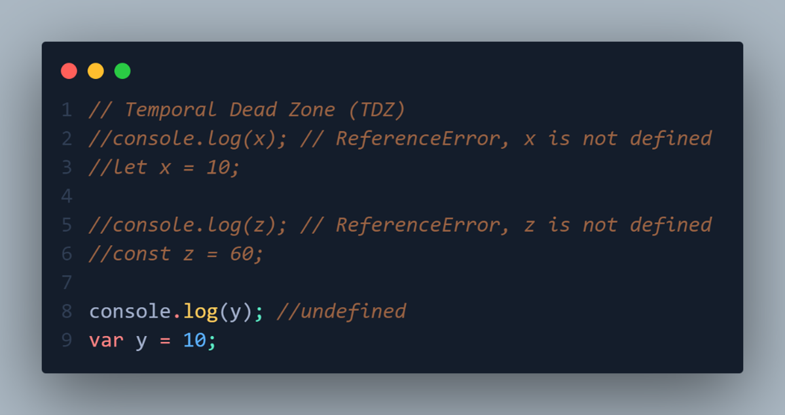
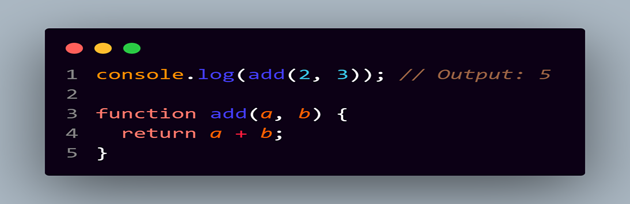
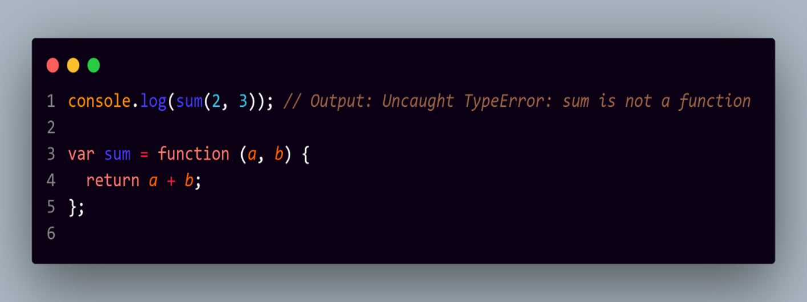
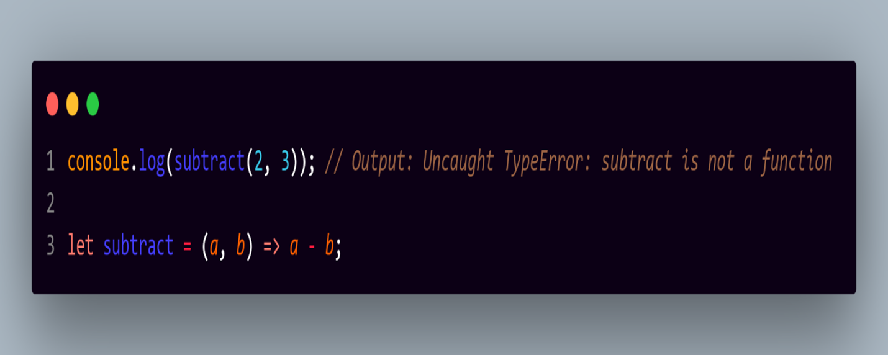

# CLOSURE AND HOISTING

- [CLOSURE AND HOISTING](#closure-and-hoisting)
  - [Lexical Scoping](#lexical-scoping)
  - [Closures](#closures)
  - [Hoisting](#hoisting)
    - [Variable Hoisting](#variable-hoisting)
      - [Temporal Dead Zone](#temporal-dead-zone)
    - [Function Hoisting](#function-hoisting)

## Lexical Scoping

Lexical scoping refers to the way in which the compiler determines the scope of a variable or function at the time it is written, not when it is executed. This means that the scope of a variable is determined by its location within the code, not by the flow of control in the program.

`Example:1`



In the example, we have three functions `first, second, and third`. When we create a function, each function has its scope and execution context. As we can see function `second` is inside function `first`, so we can say that `first` is the parent function and `second` is the inner or child function. If we don’t have variable we are trying to access in inner function, it searches for that variable in parent function and in global scope too. Function `second` access the variable `b and a` from parent function and global variable respectively. But if we look at function `third`, it cannot access `b and c`, because this function is not inside the parent function, but it can access global variable `a`, it is a different function and has its scope and execution context, so, it throws an error if we run that code.

`Example:2`



In this example, x and y are variables with local scope within the outer and inner functions, respectively. The scope chain for the inner function includes both the local scope of inner and the local scope of outer, allowing y to access x. This is an example of lexical scoping, where the scope of a variable is determined by its location within the code, and not by the flow of control in the program.

---

## Closures

A closure is a feature in JavaScript where an inner function has access to the outer (enclosing) function's variables - `scope chain`

The closure has three scope chains:

- It has access to its own scope variables defined between its curly brackets.
- It has access to the outer function's variables.
- It has access to the global variables.

`Example`

```js
function outer() {
  var b = 100;
  function inner() {
    var a = 200;
    console.log(a + b);
  }
  return inner;
}
const X = outer(); // first invoke
console.log(X); // output => function inner()
X(); // output => 300
```

Here we have two functions:

- an outer function(outer) which has a variable b, and returns the inner function.
- an inner function(inner) which has its variable a, and accesses an outer variable b, within its function body.



---

Another Example:

```js
function outerFunction(outerValue) {
  // This inner function is a closure because it "closes over" the outerValue parameter.
  function innerFunction(innerValue) {
    return outerValue + innerValue;
  }

  return innerFunction;
}

// Create two closures with different outerValues
const closure1 = outerFunction(10);
const closure2 = outerFunction(20);

// Use the closures to add values to their respective outerValues
console.log(closure1(5)); // Output: 15 (10 + 5)
console.log(closure2(5)); // Output: 25 (20 + 5)
```

> In this example:

- outerFunction takes an outerValue parameter and defines an innerFunction within it.
- innerFunction is a closure because it references the outerValue variable from its containing scope, even after outerFunction has finished executing.
- When we call outerFunction(10), it returns innerFunction with outerValue set to 10, creating a closure. Similarly, outerFunction(20) creates another closure with outerValue set to 20.
- When we later call closure1(5), it adds 5 to the outerValue of the first closure, resulting in 15. Likewise, closure2(5) adds 5 to the outerValue of the second closure, resulting in 25.

---

Another Example

```js
function createCounter() {
  let count = 0; // This variable is private to the closure

  function increment() {
    count++;
    console.log("Incremented: " + count);
  }

  function decrement() {
    if (count > 0) {
      count--;
      console.log("Decremented: " + count);
    } else {
      console.log("Cannot decrement below 0.");
    }
  }

  function getCount() {
    return count;
  }

  return {
    increment,
    decrement,
    getCount,
  };
}

const counter = createCounter();

counter.increment(); // Output: Incremented: 1
counter.increment(); // Output: Incremented: 2
counter.decrement(); // Output: Decremented: 1
console.log("Current count: " + counter.getCount()); // Output: Current count: 1
```

> In this example:

- createCounter is a function that creates a closure. Inside this closure, there's a private variable count that is hidden from the outside world.
- The closure provides three public functions: increment, decrement, and getCount, which allow controlled access to the count variable.
- When you create a counter using createCounter(), you get an object with methods to interact with the counter's state.
- You can increment and decrement the counter using the increment and decrement methods, and you can retrieve the current count using getCount.

---

## Hoisting

JavaScript hoisting is a behaviour in which variable and function declarations are moved to the top of their containing scope during the compilation phase, before the code is executed.

This allows to use variables and functions before they are actually declared in the code.

### Variable Hoisting

In the case of variable declarations, only the declaration is hoisted, not the initilization. This means that the variable name is brought to the top of the scope, but its value is not assigned until the actual line of code where the variable is initialized.



Here, it shows undefined because “a” has not been declared, so, the JavaScript engine put the variable “a” to the top and sets its value to undefined. Therefore, we get undefined. It only works in the case of var keyword.

> Variables declared using "let" in JavaScript have block scope, which means they are only accessible within the block of code where they are defined.
> unlike variables declared with "var", "let" variables are not hoisted to the top of their containing function or block scope. Instead. they are hoisted to the top pf their respective block but remain in the "temporal dead zone" until they are actually declared.

`Example`



- Variables declared with let and const are also hoisted, but they are not initialized (TDZ-Temporal Dead Zone) until the point of declaration.
- Trying to access such variables before declaration results in a reference error as shown in the example.

#### Temporal Dead Zone

The temporal dead zone (TDZ) in JavaScript refers to the period of time between the declaration and initialization of a variable declared with let or const where the variable cannot be accessed or used. In this period, the variable is said to be in the TDZ and is considered to be in an "uninitialized" state.



In contrast, if x was declared with var, it would be assigned a value of undefined before the assignment and the code would not throw an error.

---

### Function Hoisting

Function declarations in JavaScript are hoisted to the top of their containing scope. This means that we can call a function before its actual declafration in the code, and it will still work as expected.



Even though the function add is declared after it is used, the code still runs correctly because the declaration of the function is hoisted to the top of its scope. This allows the function to be used before it is declared in the code.

It's important to note that hoisting only works for function declarations, not function expressions. Function expressions are assigned to variables, and variable assignments are not hoisted. For example:



- A variable "add" is declared using var, but it's assigned a function expression.
- During compilation, only the variable declaration var "add" is hoisted, not the assignment.
- When "add" is called before the assignment, it throws an error since "add" is not yet assigned as a function.

`Arrow functions` in JavaScript are treated as function expressions, not function declarations. This means that hoisting does not apply to arrow functions, and they cannot be used before they are declared in the code.



---
