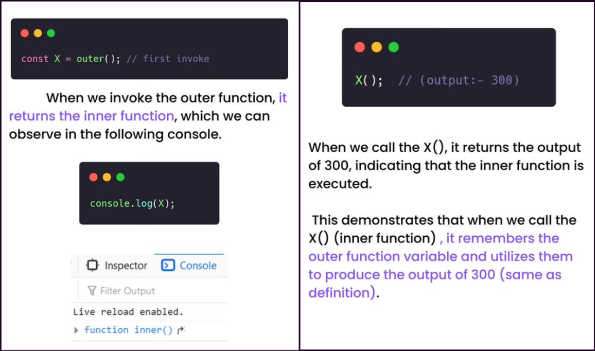

# CLOSURE

## Definition

A closure is a feature in JavaScript where an inner function has access to the outer (enclosing) function's variables - `scope chain`

The closure has three scope chains:

- It has access to its own scope variables defined between its curly brackets.
- It has access to the outer function's variables.
- It has access to the global variables.

`Example`

```js
function outer() {
  var b = 100;
  function inner() {
    var a = 200;
    console.log(a + b);
  }
  return inner;
}
const X = outer(); // first invoke
console.log(X); // output => function inner()
X(); // output => 300
```

Here we have two functions:

- an outer function(outer) which has a variable b, and returns the inner function.
- an inner function(inner) which has its variable a, and accesses an outer variable b, within its function body.


