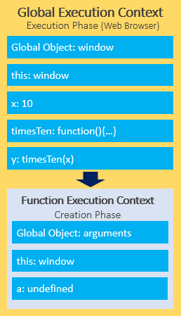
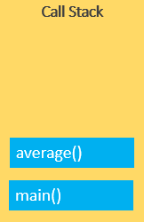
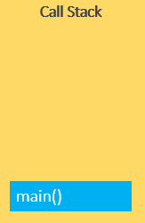
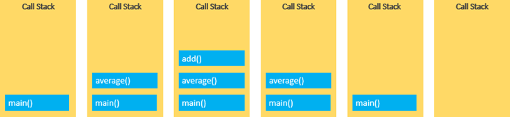

# JAVASCRIPT ENGINE

- [JAVASCRIPT ENGINE](#javascript-engine)
  - [Introduction](#introduction)
  - [Compilation vs Interpretation](#compilation-vs-interpretation)
  - [How Does JavaScript work?](#how-does-javascript-work)
  - [Execution Context](#execution-context)
  - [Execution Context Example](#execution-context-example)
    - [The creation phase](#the-creation-phase)
    - [The execution phase](#the-execution-phase)
  - [Call Stack](#call-stack)
    - [JavaScript call stack example](#javascript-call-stack-example)
  - [Asynchronous JavaScript](#asynchronous-javascript)

## Introduction

The JavaScript engine executes and compiles JavaScript into native machine code. Every major browser has developed its JS engine: Google's Chrome, EDGE AND OPERA uses V8, Safari uses JavaScript Core, and Firefox uses Spider Monkey.


## Compilation vs Interpretation

`Compilation and interpretation` are two ways of executing a programming language. In the context of JavaScript, these terms refer to how the code is executed by the JavaScript engine.

`Compilation` is the process of converting source code into machine-readable code before the program is executed. In JavaScript, the JavaScript engine compiles the code just-in-time (JIT) before executing it, meaning that the code is compiled right before it is executed, rather than before the program is run.

`Interpretation`, on the other hand, is the process of executing source code line by line without any prior compilation. In JavaScript, the JavaScript engine interprets the code as it is executed, meaning that the code is executed directly without being compiled into machine code first.

In conclusion, `JavaScript is an interpreted language`, with elements of just-in-time (JIT) compilation, as the code is interpreted by the JavaScript engine as it is executed, and it may also be compiled just before it is executed for performance optimization.


## How Does JavaScript work?


The first thing V8 needs to do is to download the source code. This can be done via a network, cache, or service worker. Once the code is received, we need to change it in a way that the compiler can understand. This process is called parsing and consists of the scanner and the parser itself.

The scanner takes the JS file and converts it to the list of known tokens. The parser picks it up and creates an Abstract Syntax Tree (AST): a tree representation of the source code. Each node of the tree denotes a construct occurring in the code.


- A JavaScript engine works by parsing and executing JavaScript code. The engine consists of two main parts: a compiler and a runtime.
- The compiler takes the JavaScript code and compiles it into an intermediate representation called bytecode. The bytecode is optimized for efficient execution and then executed by the runtime environment.
- The runtime environment is responsible for managing the execution of the code, including managing memory, providing APIs for the code to interact with, and executing the optimized bytecode.
- When the JavaScript engine encounters a piece of code, it checks its type and evaluates it. The engine uses a just-in-time (JIT) compilation approach, which means that it compiles the code on the fly as it is executed, rather than compiling the entire code before it starts to run.
- This approach allows for faster execution time, as the code is optimized for the specific environment it is running in. The engine continues this process of parsing, compiling, and executing until the entire program has been executed.

`Example`

```js
function add(a, b) {
  return a + b:
}
const result =  add(3, 4);
console.log(result); // 7
```

> When this code is executed, the JavaScript engine first interprets the code and performs an initial parse to check for syntax errors. Once the code passes the syntax check, it is compiled just-in-time (JIT) by the JavaScript engine, which generates optimized machine code for the code being executed. The generated machine code is then executed, producing the final result.
> This JIT compilation approach in JavaScript allows for fast and efficient execution, as well as dynamic updates to the code as it is being executed, without the need for recompilation of the entire codebase.

## Execution Context

- An execution context in JavaScript is an abstract concept that represents the environment in which JavaScript code is executed. It includes information about the current code being executed, such as the value of the this keyword and the variables and functions defined within the context.
- There are two types of execution context in JavaScript: the global execution context and function execution contexts. The global execution context is created when the JavaScript interpreter starts and represents the code that is not inside any function. The function execution contexts are created whenever a function is called and represent the code within that function.


> Everything in JavaScript happens inside an execution context. It can be considered a big box that contains two components. The first component is the memory component which is also called a variable environment and the second component is the code component also known as the thread of execution. The code component is the main component where code is executed one by one at a time, as we already know that JS is a synchronous single-threaded language which means only one command can be executed at a time and cannot move to the next command until the previous command has been executed.

---

## Execution Context Example

```js
let x = 10;

function timesTen(a) {
  return a * 10;
}

let y = timesTen(x);

console.log(y); // 100
```

> In this example:

- First, declare the x variable and initialize its value with 10.
- Second, declare the timesTen() function that accepts an argument and returns a value that is the result of multiplication of the argument with 10.
- Third, call the timesTen() function with the argument as the value of the x variable and store result in the variable y.
  Finally, output the variable y to the Console.

> Behind the scene, JavaScript does many things. in this tutorial, you will focus on execution contexts.
> When the JavaScript engine executes the JavaScript code, it creates execution contexts.
> Each execution context has two phases: the creation phase and the execution phase.


### The creation phase

When the JavaScript engine executes a script for the first time, it creates the global execution context. During this phase, the JavaScript engine performs the following tasks:

- Create the global object i.e., window in the web browser or global in Node.js.
- Create the this object and bind it to the global object.
- Setup a memory heap for storing variables and function references.
- Store the function declarations in the memory heap and variables within the global execution context with the initial values as undefined.

When the JavaScript engine executes the code example above, it does the following in the creation phase:

- First, store the variables x and y and function declaration timesTen() in the global execution context.
- Second, initialize the variables x and y to undefined.


After the creation phase, the global execution context moves to the execution phase.

### The execution phase

During the execution phase, the JavaScript engine executes the code line by line, assigns the values to variables, and executes the function calls.


For each function call, the JavaScript engine creates a new function execution context.

The function execution context is similar to the global execution context. But instead of creating the global object, the JavaScript engine creates the arguments object that is a reference to all the parameters of the function:



In our example, the function execution context creates the arguments object that references all parameters passed into the function, sets this value to the global object, and initializes the a parameter to undefined.

During the execution phase of the function execution context, the JavaScript engine assigns 10 to the parameter a and returns the result (100) to the global execution context:


To keep track of all the execution contexts, including the global execution context and function execution contexts, the JavaScript engine uses the call stack,

---

## Call Stack

A call stack is a way for the JavaScript engine to keep track of its place in code that calls multiple functions. It has the information on what function is currently being run and what functions are invoked from within that function…

Also, the JavaScript engine uses a call stack to manage execution contexts:

- Global execution context
- function execution contexts
- The call stack works based on the LIFO principle i.e., last-in-first-out.

When you execute a script, the JavaScript engine creates a global execution context and pushes it on top of the call stack.

Whenever a function is called, the JavaScript engine creates a function execution context for the function, pushes it on top of the call stack, and starts executing the function.

If a function calls another function, the JavaScript engine creates a new function execution context for the function being called and pushes it on top of the call stack.

When the current function completes, the JavaScript engine pops it off the call stack and resumes the execution where it left off.

The script will stop when the call stack is empty.

### JavaScript call stack example

```js
function add(a, b) {
  return a + b;
}

function average(a, b) {
  return add(a, b) / 2;
}

let x = average(10, 20);
```

When the JavaScript engine executes this script, it places the global execution context (denoted by main() or global() function on the call stack.


The global execution context enters the creation phase and moves to the execution phase.

The JavaScript engine executes the call to the average(10, 20) function and creates a function execution context for the average() function and pushes it on top of the call stack:



The JavaScript engine starts executing the average() since because the average() function is on the top of the call stack.

The average() function calls add() function. At this point, the JavaScript engine creates another function execution context for the add() function and places it on the top of the call stack:


JavaScript engine executes the add() function and pops it off the call stack:


At this point, the average() function is on the top of the call stack, the JavaScript engine executes and pops it off the call stack.



Now, the call stack is empty so the script stops executing:


The following picture illustrates the overall status of the Call Stack in all steps:



---

## Asynchronous JavaScript

JavaScript is a single-threaded programming language. This means that the JavaScript engine has only one call stack. Therefore, it only can do one thing at a time.

When executing a script, the JavaScript engine executes code from top to bottom, line by line. In other words, it is synchronous.

Asynchronous means the JavaScript engine can execute other tasks while waiting for another task to be completed. For example, the JavaScript engine can:

- Request for data from a remote server.
- Display a spinner
- When the data is available, display it on the webpage.

To do this, the JavaScript engine uses an event loop

`Note:` > JavaScript engine uses a call stack to manage execution contexts.
The call stack uses the stack data structure that works based on the LIFO (last-in-first-out) principle.

---
