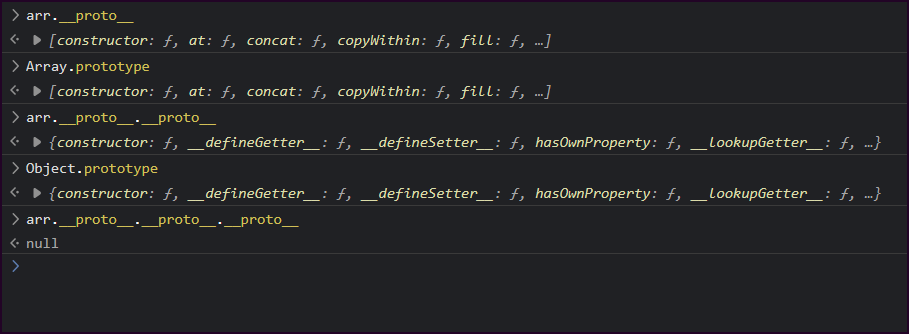
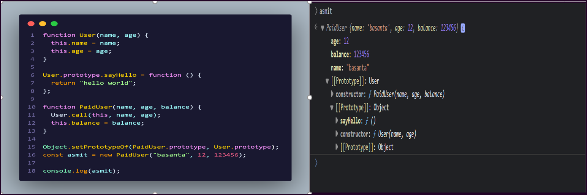
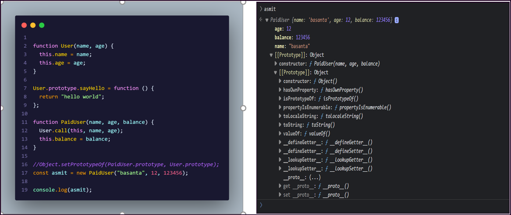

# Prototype And Classes

- [Prototype And Classes](#prototype-and-classes)
  - [Prototypes](#prototypes)
  - [Prototype Inheritance](#prototype-inheritance)

## Prototypes

Prototypes are the mechanism by which JavaScript objects inherit features from one another.

In JavaScript, objects have a special hidden property `Prototype`(as named in the specification), that is either null or references another object. That object is called “a prototype”:

whenever we create an object JS engine automatically put this hidden properties into an object and attaches it to your object, that's why we get access to those properties and methods, we can do it by using `__proto__` and this is the object where JS engine is putting all methods and functions.

`Example`

```js
let arr = [1, 2, 2, 3, 4, 3, 4, 5];

let object = {
  name: "Gyamzo",
  city: "Ktm",
  getInfo() {
    return this.name + " from " + this.city;
  },
};

function fun() {
  return "Hello function";
}
```

> in console, we can find the various properties and methods due to the prototype



---

## Prototype Inheritance

When we read a property from object, and it’s missing, JavaScript automatically takes it from the prototype. In programming, this is called “prototype inheritance”.

Click > [Prototype Inheritance](https://javascript.info/prototype-inheritance)

`Example 1`



> `asmit` prototype is `User`, User prototype is Object and inside User prototype there is a "sayHello" method, so asmit can access "sayHello method.

---



> `asmit` prototype is OBJECT, AGAIN object prototype is Object, and there is no "sayHello" method, so "asmit" can't access "sayHello" method.

---

---

`Example 2`

```js
let users = {
  getFullName() {
    return this.name + " " + this.lastName;
  },
  getAge() {
    let age = new Date().getFullYear() - this.birth;
    return age;
  },
};

let student = {
  name: "Gyamzo",
  lastName: "Sherpa",
  birth: 1996,
  // getAge: users.getAge,
};

let teacher = {
  name: "Lionel",
  lastName: "Messi",
  birth: 1997,
  getAge: users.getAge, //inherits property of users
};

// teacher.__proto__ = users;
student.__proto__ = users; //inherits properties of users

//console.log(student.getAge());
console.log(teacher.getAge());

// Object prototype
Object.prototype.myAppData = "this is a sample data";
Object.prototype.myData = function () {
  //check in console: student.myData()
  // other objects can access myData due to Object Prototype
  return "custom function";
};

String.prototype.otherData = "prop for string";
String.prototype.customLength = function () {
  return this.length + 2; //in console: student.name.length
};
```
