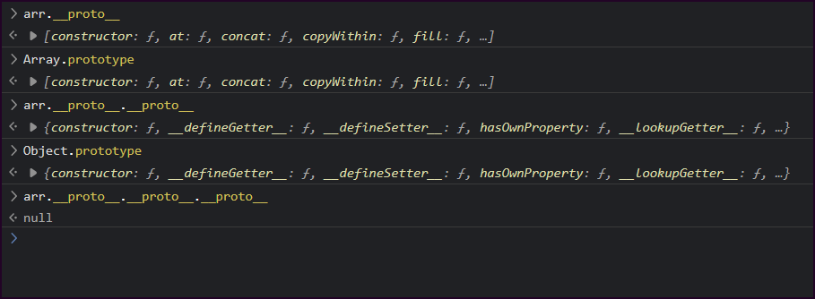
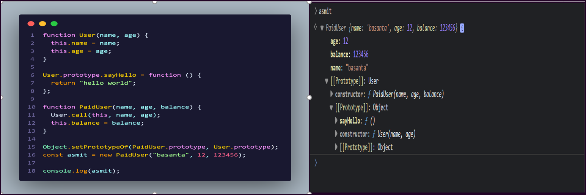
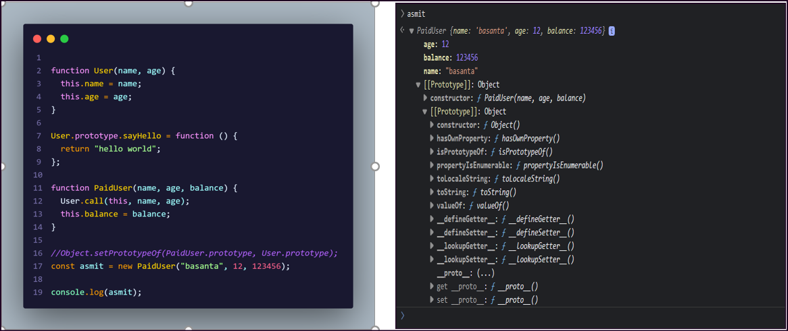
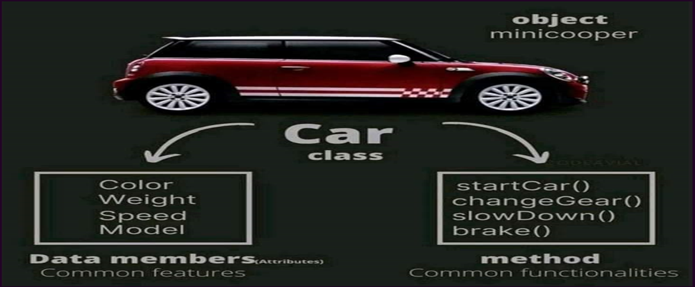
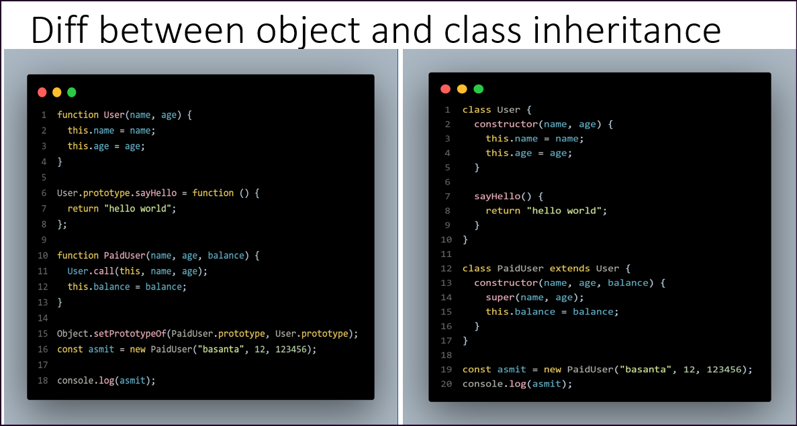

# Prototype And Classes

- [Prototype And Classes](#prototype-and-classes)
  - [Prototypes](#prototypes)
  - [Prototype Inheritance](#prototype-inheritance)
  - [Classes](#classes)
    - [Class Methods](#class-methods)
    - [Getters and Setters](#getters-and-setters)
    - [Hoisting in class](#hoisting-in-class)
    - [Use strict in class](#use-strict-in-class)
    - [Class Inheritance](#class-inheritance)
    - [JavaScript super() keyword](#javascript-super-keyword)
    - [static methods and properties](#static-methods-and-properties)
    - [Object and class inheritance](#object-and-class-inheritance)

## Prototypes

Prototypes are the mechanism by which JavaScript objects inherit features from one another.

In JavaScript, objects have a special hidden property `Prototype`(as named in the specification), that is either null or references another object. That object is called “a prototype”:

whenever we create an object JS engine automatically put this hidden properties into an object and attaches it to your object, that's why we get access to those properties and methods, we can do it by using `__proto__` and this is the object where JS engine is putting all methods and functions.

`Example`

```js
let arr = [1, 2, 2, 3, 4, 3, 4, 5];

let object = {
  name: "Gyamzo",
  city: "Ktm",
  getInfo() {
    return this.name + " from " + this.city;
  },
};

function fun() {
  return "Hello function";
}
```

> in console, we can find the various properties and methods due to the prototype



---

## Prototype Inheritance

When we read a property from object, and it’s missing, JavaScript automatically takes it from the prototype. In programming, this is called “prototype inheritance”.

Click > [Prototype Inheritance](https://javascript.info/prototype-inheritance)

`Example 1`



> `asmit` prototype is `User`, User prototype is Object and inside User prototype there is a "sayHello" method, so asmit can access "sayHello method.

---



> `asmit` prototype is OBJECT, AGAIN object prototype is Object, and there is no "sayHello" method, so "asmit" can't access "sayHello" method.

---

---

`Example 2`

```js
let users = {
  getFullName() {
    return this.name + " " + this.lastName;
  },
  getAge() {
    let age = new Date().getFullYear() - this.birth;
    return age;
  },
};

let student = {
  name: "Gyamzo",
  lastName: "Sherpa",
  birth: 1996,
  // getAge: users.getAge,
};

let teacher = {
  name: "Lionel",
  lastName: "Messi",
  birth: 1997,
  getAge: users.getAge, //inherits property of users
};

// teacher.__proto__ = users;
student.__proto__ = users; //inherits properties of users

//console.log(student.getAge());
console.log(teacher.getAge());

// Object prototype
Object.prototype.myAppData = "this is a sample data";
Object.prototype.myData = function () {
  //check in console: student.myData()
  // other objects can access myData due to Object Prototype
  return "custom function";
};

String.prototype.otherData = "prop for string";
String.prototype.customLength = function () {
  return this.length + 2; //in console: student.name.length
};
```

---

## Classes

- Classes are one of the features introduced in the ES6 version of JavaScript.
- A class is a blueprint for the object. You can create an object from the class.
- You can think of the class as a sketch (prototype) of a house. It contains all the details about the floors, doors, windows, etc. Based on these descriptions, you build the house. House is the object.
- Since many houses can be made from the same description, we can create many objects from a class.
- Classes are blueprint of an Object. A class can have many Objects because class is a template while Object are instances of the class or the concrete implementation. Let’s say we have three objects, elon_Musk, McGregor, Messi. By using classes, you can give it a new name, let’s say man. So, you can define class as a grouping of object. Messi, McGregor are the object of man class.



JavaScript class is similar to the JavaScript constructor function,

The constructor function syntax:

```js
// constructor function
function Person() {
  this.name = "Gyamzo";
  this.age = 26;
}

// create an object
const person1 = new Person();
```

Instead of using the function keyword, you use the class keyword for creating JS classes. For example,

```js
class Person {
  constructor(name) {
    this.name = name;
  }
}

// create an object
const person1 = new Person("Gyamzo");
const person2 = new Person("Messi");
```

> Note: The constructor() method inside a class gets called automatically each time an object is created.

### Class Methods

```js
class Person {
  constructor(name) {
    this.name = name;
  }

  // defining method
  greet() {
    console.log(`Hello ${this.name}`);
  }
}

// create an object
const person1 = new Person("Gyamzo");

// accessing property
console.log(person1.name); // Gyamzo

// accessing method
person1.greet(); // Hello Gyamzo
```

### Getters and Setters

In JavaScript, getter methods get the value of an object and setter methods set the value of an object.

JavaScript classes may include getters and setters. You use the get keyword for getter methods and set for setter methods. For example:

```js
class Person {
  constructor(name) {
    this.name = name;
  }

  // getter
  get personName() {
    return this.name;
  }

  set personName() {
    this.name = x;
  }
}

const person1 = new Person("Gyamzo");
console.log(person1.name); // Gyamzo

// changing the value of name property
person1.personName = "Messi";
console.log(person1.name); // Messi
```

### Hoisting in class

A class should be defined before using it. Unlike functions and other JavaScript declarations, the class is not hoisted. For example,

```js
const p = new Person(); //ReferenceError

class Person {
  constructor(name) {
    this.name = name;
  }
}
```

### Use strict in class

All the code inside the class is automatically in strict mode. For example,

```js
class Person {
  constructor() {
    a = 0;
    this.name = a;
  }
}
let p = new Person(); // ReferenceError: can't find variable: a
```

### Class Inheritance

- Inheritance enables you to define a class that takes all the functionality from a parent class and allows you to add more.
- Using class inheritance, a class can inherit all the methods and properties of another class.
- Inheritance is a useful feature that allows code reusability.

To use class inheritance, you use the extends keyword. For example,

```js
class Employee {
  constructor(n, a) {
    // console.log("employee class created");
    this.name = n;
    this.address = a;
  }
}
//inherits properties from Employee class
class Manager extends Employee {}

let mng1 = new Manager("gyamzo", "ktm");
console.log(mng1);
console.log(mng1.name);
```

> Here, in the example, the Manager class inherits all the methods and properties of the Employee class. Hence, the Manager class will now have the name property and all the method define in parent class Employee.

### JavaScript super() keyword

The super keyword used inside a child class denotes its parent class. Super keyword calls the parent class constructor. For example,

```js
class Employee {
  constructor(name, address) {
    this.name = name;
    this.address = address;
  }

  // A method to display employee information
  displayInfo() {
    console.log(`Employee Name: ${this.name}`);
    console.log(`Employee Address: ${this.address}`);
  }
  msg() {
    console.log("hello super inside child");
  }
}

class Manager extends Employee {
  constructor(name, address, department) {
    super(name, address); // Call the constructor of the base class
    this.department = department;
  }

  // Override the displayInfo method to include department
  displayInfo() {
    super.displayInfo(); // Call the base class method
    console.log(`Manager Department: ${this.department}`);
  }

  intro() {
    console.log("introduction");
  }

  info() {
    // call parent method inside child method using super()
    super.msg(); //"hello super inside child", inherit from parent

    this.intro(); //"introduction", refer to its current properties
  }
}

// Create instances of Employee and Manager
const emp1 = new Employee("John Doe", "123 Main St");
const mng1 = new Manager("Alice Smith", "456 Elm St", "HR");

// Call the displayInfo method on both instances
emp1.displayInfo();
mng1.displayInfo();
console.log(mng1.info()); //hello super inside child, //introduction
```

> In this example, we have an Employee class with a displayInfo method to display employee information, and a Manager class that extends Employee. The Manager class adds a department property and overrides the displayInfo method to include department information.

- `Employee` Class:

  - The Employee class has a constructor that takes name and address as parameters and assigns them to instance properties.
  - It has a displayInfo method that displays the employee's name and address when called.
  - It also has a msg method that prints "hello super inside child."

- `Manager` Class (Extending Employee)

  - The `Manager` class extends the Employee class, which means it inherits the properties and methods of the Employee class.
  - It has a constructor that takes name, address, and department as parameters. It calls the constructor of the base class (Employee) using super(name, address) to initialize the inherited properties.
  - It has an intro method that prints "introduction."
  - It has an info method, which demonstrates how to use the super keyword to call a parent class method (msg) and also calls its own intro method.

- `Creating Instances`:

  - An instance of the Employee class is created with the name "John Doe" and address "123 Main St" and stored in the emp1 variable.
  - An instance of the Manager class is created with the name "Alice Smith," address "456 Elm St," and department "HR" and stored in the mng1 variable.

- `Calling Methods`:

  - emp1.displayInfo() calls the displayInfo method of the Employee class, which displays the name and address of the employee.
  - mng1.displayInfo() calls the displayInfo method of the Manager class. Since the Manager class does not have its own displayInfo method, it inherits the method from the Employee class and displays the name and address, along with the department.
  - mng1.info() calls the info method of the Manager class. - Inside the info method: - super.msg() calls the msg method of the parent class (Employee), which prints "hello super inside child." - this.intro() calls the intro method of the Manager class, which prints "introduction."

---

### static methods and properties

```js
class Person {
  constructor(n, a) {
    this.name = n;
    this.age = a;
  }

  sayHi() {
    console.log("Hi....");
  }

  static address = "Kathmandu";

  static hello() {
    console.log("hello");
  }
}

let person1 = new Person("gyamzo", 26);
person1.sayHi();

// static "hello", gets call from class not from object
// person1.hello(); "hello", // uncaught TypeError: person1.hello is not a function

Person.hello(); // no error

console.log(person1.address); // undefined due to static
console.log(person1);
```

> There's some benefit to this. To call an instance method, you would have to create a new instance of the class, and then call the method (it's a two-step process). With static methods, this isn't necessary. Static methods are often utility functions, such as functions to create or clone objects, whereas static properties are useful for caches, fixed-configuration, or any other data you don't need to be replicated across instances. Static methods give the method to the constructor of the class... not the instance. This makes it so you can call ClassName.functionName(param);

### Object and class inheritance



---
