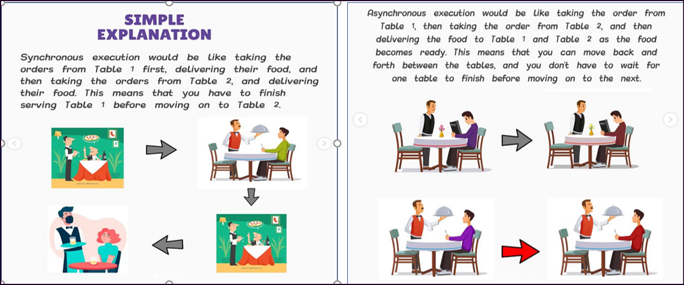
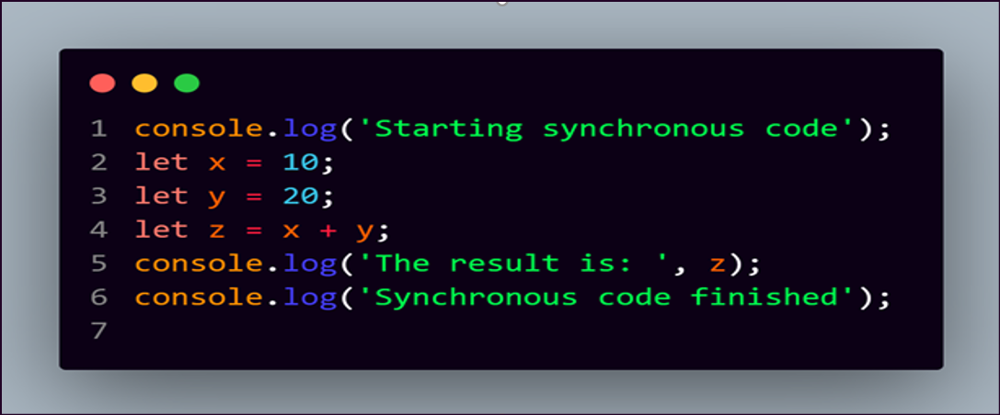
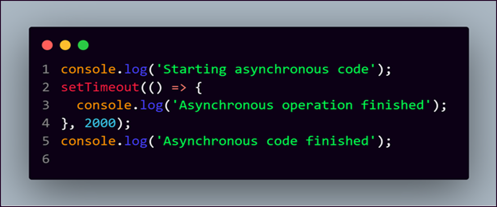

# Asynchronous vs Synchronous

- [Asynchronous vs Synchronous](#asynchronous-vs-synchronous)
  - [Introduction](#introduction)
  - [SYNCHRONOUS](#synchronous)
  - [ASYNCHRONOUS](#asynchronous)

## Introduction

## SYNCHRONOUS

Synchronous JavaScript refers to code that is executed in a blocking manner, meaning that the next line of code won't be executed until the current line has finished executing. In a synchronous program, each line of code is executed one after the other, in the order they are written, and the program blocks until each line is executed completely.
Well, JavaScript is by default Synchronous [single threaded]. Think about it like this – one thread means one hand with which to do stuff.

Here's an example of synchronous JavaScript code:

> In this example, each line of code is executed one after the other, in the order they are written. The program blocks until each line is executed completely, and the output is displayed in the order in which it is written.

Synchronous code is straightforward and easy to understand, but it can also be limiting because it blocks the program from doing anything else until the current line of code has finished executing. This can lead to slow performance and unresponsive UI if the code takes a long time to execute. In cases where you have long-running tasks, it is often better to use asynchronous code.

---

## ASYNCHRONOUS

Asynchronous JavaScript refers to code that is executed in a non-blocking manner, meaning that the program can continue to run and execute other code even while an asynchronous operation is being performed.

In asynchronous JavaScript, instead of waiting for a long-running operation to finish before moving on to the next line of code, the program continues to run and the operation is performed in the background. When the operation is complete, a callback function is executed, allowing the program to continue executing the next lines of code.

Here's an example of asynchronous JavaScript code using the setTimeout function:

> In this example, the program first logs "Starting asynchronous code" and then sets a timer for 2 seconds using the setTimeout function. The setTimeout function is asynchronous because it doesn't block the program from executing the next lines of code. The program then logs "Asynchronous code finished". After 2 seconds have passed, the setTimeout function calls its callback function, which logs "Asynchronous operation finished".

Asynchronous JavaScript allows the program to continue running and executing other code, even while long-running operations are being performed, which can lead to better performance. However, it can also make the code more complex, as the program must keep track of multiple operations that are executing in parallel.
