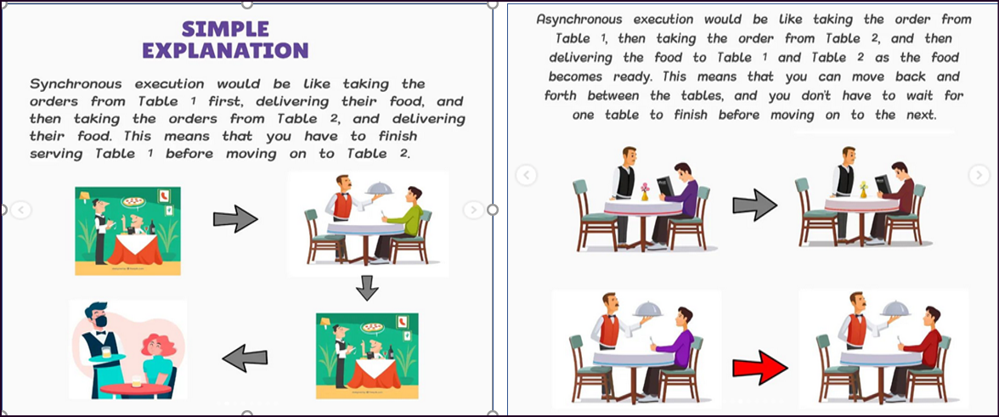
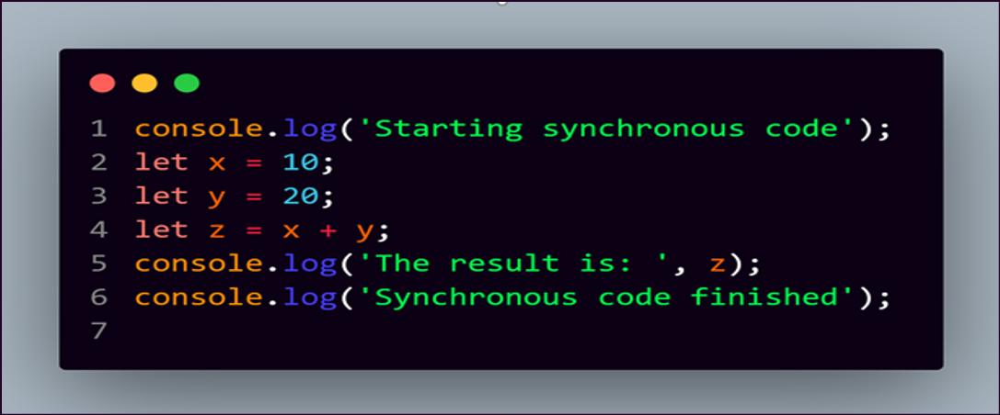
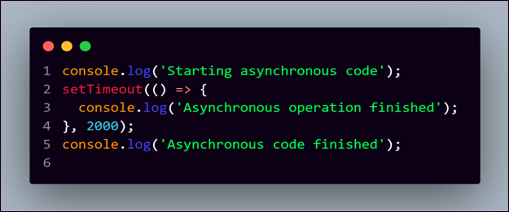
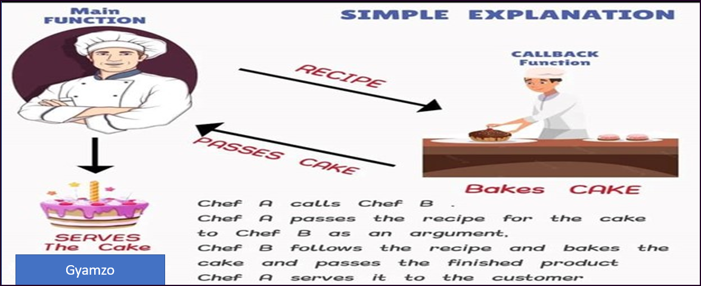
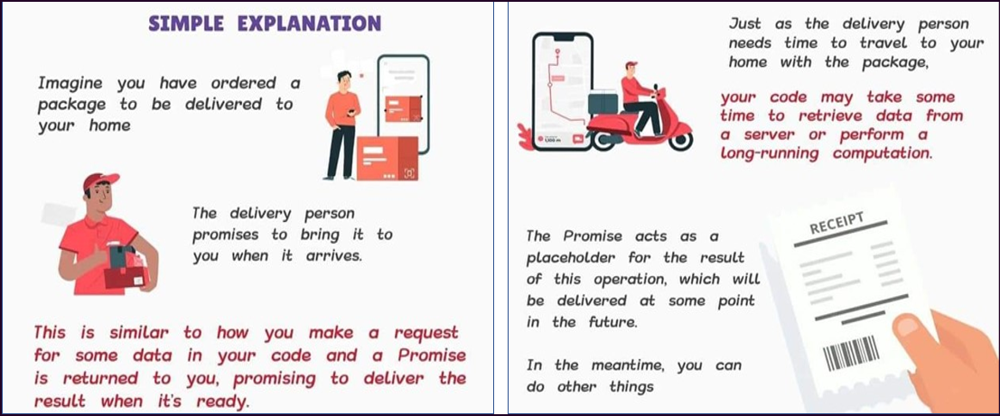
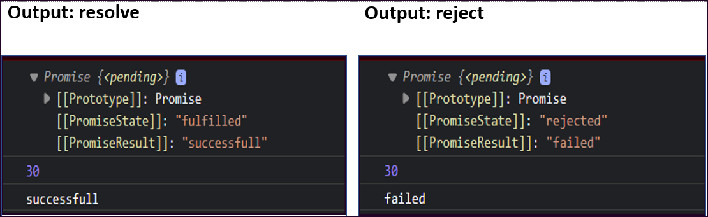
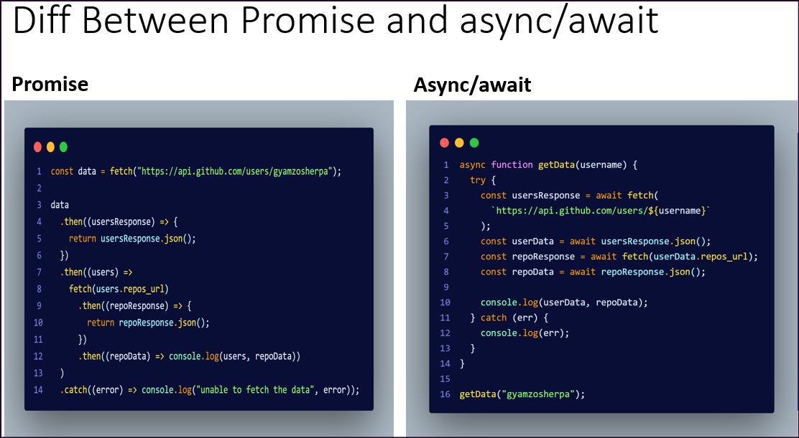

# Promise - async-await

- [Promise - async-await](#promise---async-await)
  - [Asynchronous vs Synchronous](#asynchronous-vs-synchronous)
  - [SYNCHRONOUS](#synchronous)
  - [ASYNCHRONOUS](#asynchronous)
  - [callback](#callback)
    - [Callback Hell](#callback-hell)
  - [Promise](#promise)
    - [HTTP requests using Fetch API](#http-requests-using-fetch-api)
    - [Promise Chaining](#promise-chaining)
  - [Async Await](#async-await)
    - [Fetch data using async/await](#fetch-data-using-asyncawait)
    - [Difference between promise and async-await](#difference-between-promise-and-async-await)

## Asynchronous vs Synchronous



## SYNCHRONOUS

Synchronous JavaScript refers to code that is executed in a blocking manner, meaning that the next line of code won't be executed until the current line has finished executing. In a synchronous program, each line of code is executed one after the other, in the order they are written, and the program blocks until each line is executed completely.
Well, JavaScript is by default Synchronous [single threaded]. Think about it like this – one thread means one hand with which to do stuff.

Here's an example of synchronous JavaScript code:



> In this example, each line of code is executed one after the other, in the order they are written. The program blocks until each line is executed completely, and the output is displayed in the order in which it is written.

Synchronous code is straightforward and easy to understand, but it can also be limiting because it blocks the program from doing anything else until the current line of code has finished executing. This can lead to slow performance and unresponsive UI if the code takes a long time to execute. In cases where you have long-running tasks, it is often better to use asynchronous code.

---

## ASYNCHRONOUS

Asynchronous JavaScript refers to code that is executed in a non-blocking manner, meaning that the program can continue to run and execute other code even while an asynchronous operation is being performed.

In asynchronous JavaScript, instead of waiting for a long-running operation to finish before moving on to the next line of code, the program continues to run and the operation is performed in the background. When the operation is complete, a callback function is executed, allowing the program to continue executing the next lines of code.

Here's an example of asynchronous JavaScript code using the setTimeout function:



> In this example, the program first logs "Starting asynchronous code" and then sets a timer for 2 seconds using the setTimeout function. The setTimeout function is asynchronous because it doesn't block the program from executing the next lines of code. The program then logs "Asynchronous code finished". After 2 seconds have passed, the setTimeout function calls its callback function, which logs "Asynchronous operation finished".

Asynchronous JavaScript allows the program to continue running and executing other code, even while long-running operations are being performed, which can lead to better performance. However, it can also make the code more complex, as the program must keep track of multiple operations that are executing in parallel.

---

## callback

- A callback is a function that is to be executed after another function has finished executing.
- The benefit of using a callback function is that you can wait for the result of a previous function call and then execute another function call.
- A function that is passed as an argument to another function is called a callback function.



`Basic example`

```js
function greet(name, callback) {
  console.log("Hello, " + name + "!");
  callback();
}

function sayGoodbye() {
  console.log("Goodbye!");
}

greet("Alice", sayGoodbye);
```

> In this example, the greet function takes a name and a callback function as arguments. It logs a greeting message and then calls the callback function. When greet is called with the sayGoodbye function as the callback, it logs both a greeting and a goodbye message.

`Example:2`

```js
const arr = [1, 2, 3, 4, 5, 6];

function calculator(arr, callback) {
  const ans = [];

  for (let i = 0; i < arr.length; i++) {
    const element = callback(arr[i]);
    ans.push(element);
  }
  console.log(ans);
  return "done";
}

function add(a) {
  return a + 10;
}

function multiply(a) {
  return a * 10;
}

// calculator(arr, (a) => a * 10);
calculator(arr, multiply);
calculator(arr, add);
```

### Callback Hell

Callback hell, also known as "Pyramid of Doom," is a situation in JavaScript where you have deeply nested callbacks, making the code difficult to read and maintain. This typically occurs in scenarios with multiple asynchronous operations.

Here's an example to illustrate callback hell:

```js
// Simulated asynchronous operations with callbacks
function operation1(callback) {
  setTimeout(function () {
    console.log("Operation 1 completed");
    callback();
  }, 1000);
}

function operation2(callback) {
  setTimeout(function () {
    console.log("Operation 2 completed");
    callback();
  }, 1000);
}

function operation3(callback) {
  setTimeout(function () {
    console.log("Operation 3 completed");
    callback();
  }, 1000);
}

function operation4(callback) {
  setTimeout(function () {
    console.log("Operation 4 completed");
    callback();
  }, 1000);
}

// Nested callbacks (Callback Hell)
operation1(function () {
  operation2(function () {
    operation3(function () {
      operation4(function () {
        console.log("All operations completed");
      });
    });
  });
});
```

> In this example:

- We have four simulated asynchronous operations (operation1, operation2, operation3, and operation4) that each take a callback function.
- Inside the main code block, these operations are nested within each other, creating a deep callback structure.
- Each operation takes some time to complete (simulated using setTimeout), and the next operation is called only after the previous one finishes.
- Finally, when all operations are completed, a message is logged to indicate that.

`Another example: callback hell`

```js
let stocks = {
  Fruits: ["strawberry", "grapes", "banana", "apple"],
  liquid: ["water", "ice"],
  holder: ["cone", "stick"],
  toppings: ["chocolate", "peanuts"],
};

let isShopOpen = true;

function order(time, work, callback) {
  if (isShopOpen) {
    setTimeout(() => {
      work();
      callback();
    }, time);
  } else {
    console.log("shop is closed");
  }
}

order(
  2000,
  () => {
    console.log(`${stocks.Fruits[0]} was selected`);
  },
  () => {
    order(
      1000,
      () => {
        console.log("production has started");
      },
      () => {
        order(
          2000,
          () => {
            console.log("fruit has been chopped");
          },
          () => {
            order(
              1000,
              () => {
                console.log(
                  `${stocks.liquid[0]} and ${stocks.liquid[1]} added`
                );
              },
              () => {
                order(
                  1000,
                  () => {
                    console.log("start the machine");
                  },
                  () => {
                    order(
                      2000,
                      () => {
                        console.log(`ice cream placed on ${stocks.holder[1]}`);
                      },
                      () => {
                        order(
                          3000,
                          () => {
                            console.log(`${stocks.toppings[0]} as toppings`);
                          },
                          () => {
                            order(
                              2000,
                              () => {
                                console.log("serve ice cream");
                              },
                              () => {
                                console.log("shop is closed");
                              }
                            );
                          }
                        );
                      }
                    );
                  }
                );
              }
            );
          }
        );
      }
    );
  }
);
```

> This structure can quickly become hard to manage and read as you add more operations or error handling. It can lead to callback hell, which is challenging to maintain and debug.

To mitigate callback hell, we can use techniques like Promises or async/await in modern JavaScript to make code more readable and maintainable by avoiding deep callback nesting.

---

## Promise

It is an object representing the eventual completion or failure of an asynchronous operation. Essentially, a promise is a returned object to which you attach callbacks, instead of passing callbacks into a function.

A JavaScript promise has a specific syntax that you need to follow in order to use promises.

`Syntax`

```js
const promise = new Promise((resolve, reject) => {
  // Your code here
});
```

- `const promise`: This declares a constant named promise that will hold the promise object.
- `new Promise`: This creates a new promise object.
- `((resolve, reject) { })`: This is the function that will be executed when the promise is created. It takes in two parameters: resolve and reject.
- The resolve function is used to resolve the promise when it succeeds, and
- The reject function is used to reject the promise when an
  error occurs.



A Promise is an object representing the eventual completion or failure of an asynchronous operation. It provides a way to register callbacks to be called when the promise is fulfilled or rejected.

`Example: 1`

```js
// example:1
const promise = new Promise((resolve, reject) => {
  setTimeout(() => {
    resolve("successfull");
    //reject("failed");
  }, 5000);
});

console.log(promise);

promise
  .then((value) => {
    console.log(value);
  })
  .catch((error) => {
    console.log(error);
  });

const sum = 10 + 20;
console.log(sum); // display sum value first, after 5 seconds promise come into action
```

> output



`Example: 2`

```js
// example:2
const setName = new Promise((resolve, reject) => {
  const name = "Gyamzo";
  setTimeout(() => {
    if (name.length > 5) {
      resolve(name);
    } else {
      reject("invalid name");
    }
  }, 5000);
});

console.log(setName);

setName
  // this function will be called when the promise is resolved
  .then((value) => {
    console.log(`hello, ${value}`);
  })
  // this function will be called when the promise is resolved
  .catch((error) => {
    console.log(error);
  });
```

### HTTP requests using Fetch API

- The Fetch API is a simple interface for fetching resources.
- Fetch allows us to make network request and handle responses easier.
- The Fetch API uses Promises, which provides a way to avoid callbacks hell.
- The fetch function takes one mandatory argument, which is the path to the resource you want to fetch and returns a Promise that resolves to the Response of that request.

Here's an example of using Promises to handle asynchronous operations, such as fetching data from a remote API:

```js
let getDataFromAPI = function () {
  return new Promise((resolve, reject) => {
    fetch("https://jsonplaceholder.typicode.com/users")
      .then((user) => user.json())
      .then((people) => {
        console.log(people);
        const name = people.map((person) => person.name);
        console.log(name);
      })
      .catch((error) => reject(error));
  });
};

getDataFromAPI();

// let users = fetch("https://jsonplaceholder.typicode.com/users");

// users
//   .then((user) => {
//     return user.json();
//   })
//   .then((people) => {
//     //console.log(people);
//     const name = people.map((person) => person.name);
//     console.log(name);
//   })
//   .catch((err) => {
//     console.log("no users found");
//   });
```

In this example, the `getDataFromAPI` function returns a Promise that fetches data from a remote API using the fetch function. If the data is successfully retrieved, it is passed to the resolve function, otherwise the error is passed to the reject function. The returned Promise is then handled using the then and catch methods to log the data or the error.

---

### Promise Chaining

When the condition is true, it “resolves”, and “then” come to action but when it is false it “rejects” and “catches” come to action.

- .then works when a promise is resolved
- .catch works when a promise is rejected

```js
// promise chaining
let stocks = {
  Fruits: ["strawberry", "grapes", "banana", "apple"],
  liquid: ["water", "ice"],
  holder: ["cone", "stick"],
  toppings: ["chocolate", "peanuts"],
};

let isShopOpen = true;
let order = (time, work) => {
  return new Promise((resolve, reject) => {
    if (isShopOpen) {
      setTimeout(() => {
        resolve(work());
      }, time);
    } else {
      reject(console.log("shop is closed"));
    }
  });
};

order(2000, () => {
  console.log(`${stocks.Fruits[0]} was selected`);
})
  .then(() => {
    return order(1000, () => console.log("production has stsrted"));
  })
  .then(() => {
    return order(2000, () => console.log("fruit has been chopped"));
  })
  .then(() => {
    return order(1000, () =>
      console.log(`${stocks.liquid[0]} and ${stocks.liquid[1]} added`)
    );
  })
  .then(() => {
    return order(1000, () => console.log("start the machine"));
  })
  .then(() => {
    return order(2000, () =>
      console.log(`ice cream placed on ${stocks.holder[1]}`)
    );
  })
  .then(() => {
    return order(3000, () => console.log(`${stocks.toppings[0]} as toppings`));
  })
  .then(() => {
    return order(2000, () => console.log("serve ice cream"));
  })
  .catch(() => console.log("shop is closed"));
```

---

## Async Await

Async Await is supposed to be the better way to write “promises” and it helps us keep our code simple and clean.
All you have to do is write the word async before any regular function and it becomes a promise.
We use the “try” keyword to run our code while we use “catch” to catch our errors. It's the same concept we saw when we looked at promises.

- Promises in JS -> resolve or reject.
- Async / Await in JS -> try, catch.
- The keyword await makes JavaScript wait until a promise settles and returns its result.
- When using Async/ Await, you can also use the `.then, .catch, and .finally` handlers as well which are a core part of promises.

`Example`

```js
let promise = new Promise(function (resolve, reject) {
  setTimeout(function () {
    resolve("Promise resolved");
  }, 4000);
});

//async
async function asyncFunc() {
  // wait until promise resolves
  let result = await promise;

  console.log(result);
  console.log("hello");
}

// calling the async function
asyncFunc();
```

`Example:2: converting promise to async/await`

```js
let stocks = {
  Fruits: ["strawberry", "grapes", "banana", "apple"],
  liquid: ["water", "ice"],
  holder: ["cone", "stick"],
  toppings: ["chocolate", "peanuts"],
};

let isShopOpen = true;

const order = async (time, work) => {
  return new Promise(async (resolve, reject) => {
    if (isShopOpen) {
      setTimeout(async () => {
        await work();
        resolve();
      }, time);
    } else {
      reject("shop is closed");
    }
  });
};

const makeIceCream = async () => {
  try {
    await order(2000, () => {
      console.log(`${stocks.Fruits[0]} was selected`);
    });
    await order(1000, () => {
      console.log("production has started");
    });
    await order(2000, () => {
      console.log("fruit has been chopped");
    });
    await order(1000, () => {
      console.log(`${stocks.liquid[0]} and ${stocks.liquid[1]} added`);
    });
    await order(1000, () => {
      console.log("start the machine");
    });
    await order(2000, () => {
      console.log(`ice cream placed on ${stocks.holder[1]}`);
    });
    await order(3000, () => {
      console.log(`${stocks.toppings[0]} as toppings`);
    });
    await order(2000, () => {
      console.log("serve ice cream");
    });
  } catch (error) {
    console.log(error);
  }
};

makeIceCream();
```

### Fetch data using async/await

Here's a basic example of using async/await to perform a simple HTTP request:

```js
async function getData(username) {
  try {
    const usersResponse = await fetch(
      `https://api.github.com/users/${username}`
    );
    const userData = await usersResponse.json();
    const repoResponse = await fetch(userData.repos_url);
    const repoData = await repoResponse.json();

    console.log(userData, repoData);
  } catch (err) {
    console.log(err);
  }
}

getData("gyamzosherpa");
```

### Difference between promise and async-await

> Using async-await , code looks readable


