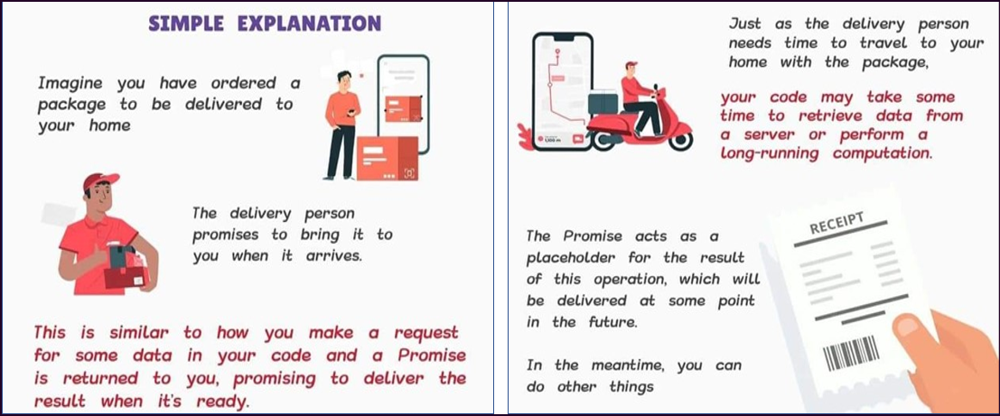
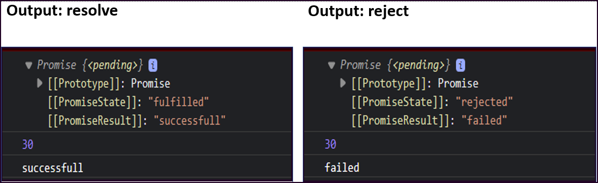
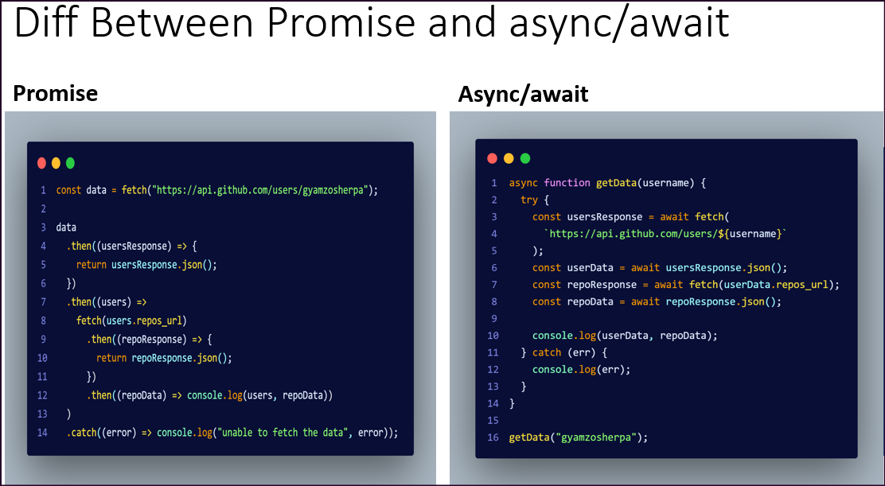

# Promise - async-await

- [Promise - async-await](#promise---async-await)
  - [Promise](#promise)
    - [HTTP requests using Fetch API](#http-requests-using-fetch-api)
    - [Promise Chaining](#promise-chaining)
  - [Async Await](#async-await)
    - [Fetch data using async/await](#fetch-data-using-asyncawait)
    - [Difference between promise and async-await](#difference-between-promise-and-async-await)

## Promise

It is an object representing the eventual completion or failure of an asynchronous operation. Essentially, a promise is a returned object to which you attach callbacks, instead of passing callbacks into a function.

A JavaScript promise has a specific syntax that you need to follow in order to use promises.

`Syntax`

```js
const promise = new Promise((resolve, reject) => {
  // Your code here
});
```

- `const promise`: This declares a constant named promise that will hold the promise object.
- `new Promise`: This creates a new promise object.
- `((resolve, reject) { })`: This is the function that will be executed when the promise is created. It takes in two parameters: resolve and reject.
- The resolve function is used to resolve the promise when it succeeds, and
- The reject function is used to reject the promise when an
  error occurs.



A Promise is an object representing the eventual completion or failure of an asynchronous operation. It provides a way to register callbacks to be called when the promise is fulfilled or rejected.

`Example: 1`

```js
// example:1
const promise = new Promise((resolve, reject) => {
  setTimeout(() => {
    resolve("successfull");
    //reject("failed");
  }, 5000);
});

console.log(promise);

promise
  .then((value) => {
    console.log(value);
  })
  .catch((error) => {
    console.log(error);
  });

const sum = 10 + 20;
console.log(sum); // display sum value first, after 5 seconds promise come into action
```

> output



`Example: 2`

```js
// example:2
const setName = new Promise((resolve, reject) => {
  const name = "Gyamzo";
  setTimeout(() => {
    if (name.length > 5) {
      resolve(name);
    } else {
      reject("invalid name");
    }
  }, 5000);
});

console.log(setName);

setName
  // this function will be called when the promise is resolved
  .then((value) => {
    console.log(`hello, ${value}`);
  })
  // this function will be called when the promise is resolved
  .catch((error) => {
    console.log(error);
  });
```

### HTTP requests using Fetch API

- The Fetch API is a simple interface for fetching resources.
- Fetch allows us to make network request and handle responses easier.
- The Fetch API uses Promises, which provides a way to avoid callbacks hell.
- The fetch function takes one mandatory argument, which is the path to the resource you want to fetch and returns a Promise that resolves to the Response of that request.

Here's an example of using Promises to handle asynchronous operations, such as fetching data from a remote API:

```js
let getDataFromAPI = function () {
  return new Promise((resolve, reject) => {
    fetch("https://jsonplaceholder.typicode.com/users")
      .then((user) => user.json())
      .then((people) => {
        console.log(people);
        const name = people.map((person) => person.name);
        console.log(name);
      })
      .catch((error) => reject(error));
  });
};

getDataFromAPI();

// let users = fetch("https://jsonplaceholder.typicode.com/users");

// users
//   .then((user) => {
//     return user.json();
//   })
//   .then((people) => {
//     //console.log(people);
//     const name = people.map((person) => person.name);
//     console.log(name);
//   })
//   .catch((err) => {
//     console.log("no users found");
//   });
```

In this example, the `getDataFromAPI` function returns a Promise that fetches data from a remote API using the fetch function. If the data is successfully retrieved, it is passed to the resolve function, otherwise the error is passed to the reject function. The returned Promise is then handled using the then and catch methods to log the data or the error.

---

### Promise Chaining

When the condition is true, it “resolves”, and “then” come to action but when it is false it “rejects” and “catches” come to action.

- .then works when a promise is resolved
- .catch works when a promise is rejected

```js
// promise chaining
let stocks = {
  Fruits: ["strawberry", "grapes", "banana", "apple"],
  liquid: ["water", "ice"],
  holder: ["cone", "stick"],
  toppings: ["chocolate", "peanuts"],
};

let isShopOpen = true;
let order = (time, work) => {
  return new Promise((resolve, reject) => {
    if (isShopOpen) {
      setTimeout(() => {
        resolve(work());
      }, time);
    } else {
      reject(console.log("shop is closed"));
    }
  });
};

order(2000, () => {
  console.log(`${stocks.Fruits[0]} was selected`);
})
  .then(() => {
    return order(1000, () => console.log("production has stsrted"));
  })
  .then(() => {
    return order(2000, () => console.log("fruit has been chopped"));
  })
  .then(() => {
    return order(1000, () =>
      console.log(`${stocks.liquid[0]} and ${stocks.liquid[1]} added`)
    );
  })
  .then(() => {
    return order(1000, () => console.log("start the machine"));
  })
  .then(() => {
    return order(2000, () =>
      console.log(`ice cream placed on ${stocks.holder[1]}`)
    );
  })
  .then(() => {
    return order(3000, () => console.log(`${stocks.toppings[0]} as toppings`));
  })
  .then(() => {
    return order(2000, () => console.log("serve ice cream"));
  })
  .catch(() => console.log("shop is closed"));
```

---

## Async Await

Async Await is supposed to be the better way to write “promises” and it helps us keep our code simple and clean.
All you have to do is write the word async before any regular function and it becomes a promise.
We use the “try” keyword to run our code while we use “catch” to catch our errors. It's the same concept we saw when we looked at promises.

- Promises in JS -> resolve or reject.
- Async / Await in JS -> try, catch.
- The keyword await makes JavaScript wait until a promise settles and returns its result.
- When using Async/ Await, you can also use the `.then, .catch, and .finally` handlers as well which are a core part of promises.

`Example`

```js
let promise = new Promise(function (resolve, reject) {
  setTimeout(function () {
    resolve("Promise resolved");
  }, 4000);
});

//async
async function asyncFunc() {
  // wait until promise resolves
  let result = await promise;

  console.log(result);
  console.log("hello");
}

// calling the async function
asyncFunc();
```

`Example:2: converting promise to async/await`

```js
let stocks = {
  Fruits: ["strawberry", "grapes", "banana", "apple"],
  liquid: ["water", "ice"],
  holder: ["cone", "stick"],
  toppings: ["chocolate", "peanuts"],
};

let isShopOpen = true;

const order = async (time, work) => {
  return new Promise(async (resolve, reject) => {
    if (isShopOpen) {
      setTimeout(async () => {
        await work();
        resolve();
      }, time);
    } else {
      reject("shop is closed");
    }
  });
};

const makeIceCream = async () => {
  try {
    await order(2000, () => {
      console.log(`${stocks.Fruits[0]} was selected`);
    });
    await order(1000, () => {
      console.log("production has started");
    });
    await order(2000, () => {
      console.log("fruit has been chopped");
    });
    await order(1000, () => {
      console.log(`${stocks.liquid[0]} and ${stocks.liquid[1]} added`);
    });
    await order(1000, () => {
      console.log("start the machine");
    });
    await order(2000, () => {
      console.log(`ice cream placed on ${stocks.holder[1]}`);
    });
    await order(3000, () => {
      console.log(`${stocks.toppings[0]} as toppings`);
    });
    await order(2000, () => {
      console.log("serve ice cream");
    });
  } catch (error) {
    console.log(error);
  }
};

makeIceCream();
```

### Fetch data using async/await

Here's a basic example of using async/await to perform a simple HTTP request:

```js
async function getData(username) {
  try {
    const usersResponse = await fetch(
      `https://api.github.com/users/${username}`
    );
    const userData = await usersResponse.json();
    const repoResponse = await fetch(userData.repos_url);
    const repoData = await repoResponse.json();

    console.log(userData, repoData);
  } catch (err) {
    console.log(err);
  }
}

getData("gyamzosherpa");
```

### Difference between promise and async-await

> Using async-await , code looks readable


